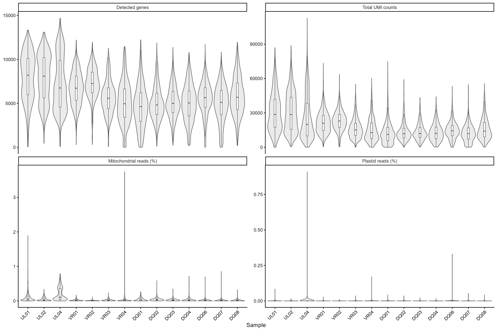
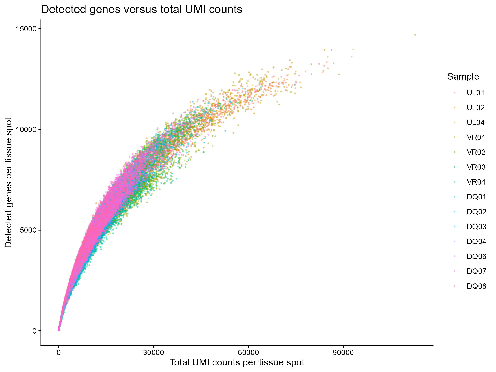
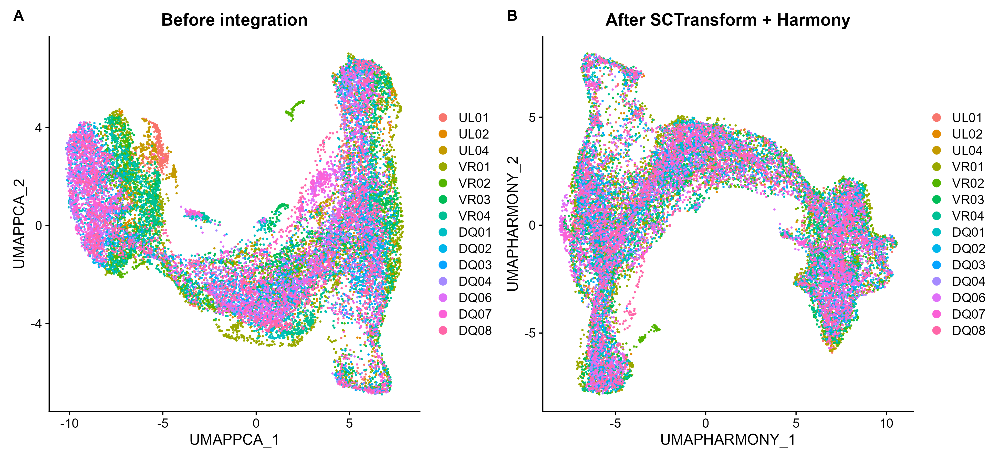

# 04. Maize shoot spatial transcriptomics: QC and Harmony integration

**Seurat v5 reproducible walkthrough for 14 maize shoot Visium datasets**

Last updated: 2026-09-01

This page documents quality control (QC), curated spot selection, normalization, principal-component analysis (PCA), and Harmony integration for 14 maize shoot spatial-transcriptomics datasets. It follows the narrative organization of the original [STUtility maize walkthrough](https://ludvigla.github.io/STUtility_web_site/Maize_data.html), while using the current Seurat v5 workflow and repository structure.

The complete executable scripts are:

- [`scripts/R/04_merge_integration/00_QC_14_samples_Seurat_v5.R`](../scripts/R/04_merge_integration/00_QC_14_samples_Seurat_v5.R)
- [`scripts/R/04_merge_integration/01_merge_14_samples_SCT_Harmony_Seurat_v5.R`](../scripts/R/04_merge_integration/01_merge_14_samples_SCT_Harmony_Seurat_v5.R)

The examples below assume that R is started from the repository root.

---

## Workflow summary

1. Load the 14 individual Seurat v5 objects.
2. Standardize cell names and retain the original names in `old_colname`.
3. Use `metadata.csv` to retain non-overlapping shoot-domain spots and add all curated metadata fields.
4. Calculate and summarize spot-level QC metrics.
5. Remove genes with fewer than 100 total reads across the curated dataset.
6. Normalize and variance-stabilize expression using `SCTransform()`.
7. Run PCA using 50 components to inspect the variance curve.
8. Retain 30 PCs, as selected from the elbow plot and used in the Bio-protocol workflow.
9. Generate a pre-integration UMAP from the PCA reduction.
10. Integrate the 14 samples with Harmony using Seurat v5 `IntegrateLayers()`.
11. Build Harmony nearest-neighbor graphs and calculate `harmony_clusters_recomputed` at resolution 2.
12. Generate a post-integration UMAP.
13. Restore the imported published `harmony_clusters` as the active identity and save the combined demonstration object.

---

## Repository structure

```text
maize_shoot_data_process_v2/
├── data/
│   ├── processed/
│   │   ├── UL01_seurat_v5.rds
│   │   ├── UL02_seurat_v5.rds
│   │   ├── UL04_seurat_v5.rds
│   │   ├── VR01_seurat_v5.rds
│   │   ├── ...
│   │   ├── DQ08_seurat_v5.rds
│   │   └── maize_shoot_14samples_SCT_harmony_seurat_v5.rds
│   ├── metadata/
│   │   └── metadata.csv
│   └── reference/
│       ├── maize_mitochondrial_genes.txt
│       └── maize_plastid_genes.txt
├── results/
│   ├── figures/
│   ├── logs/
│   └── tables/
└── scripts/
    └── R/
        └── 04_merge_integration/
            ├── 00_QC_14_samples_Seurat_v5.R
            └── 01_merge_14_samples_SCT_Harmony_Seurat_v5.R
```

The 14 sample IDs are:

```r
sample_ids <- c(
  "UL01", "UL02", "UL04",
  "VR01", "VR02", "VR03", "VR04",
  "DQ01", "DQ02", "DQ03", "DQ04", "DQ06", "DQ07", "DQ08"
)
```

---

## Setup

Load the packages and define relative project paths.

```r
library(Seurat)
library(SeuratObject)
library(harmony)
library(ggplot2)
library(patchwork)

set.seed(1234)

processed_dir <- file.path("data", "processed")
figure_dir    <- file.path("results", "figures")
table_dir     <- file.path("results", "tables")
log_dir       <- file.path("results", "logs")

dir.create(figure_dir, recursive = TRUE, showWarnings = FALSE)
dir.create(table_dir, recursive = TRUE, showWarnings = FALSE)
dir.create(log_dir, recursive = TRUE, showWarnings = FALSE)
```

Relative paths are used so the analysis can be run on another computer after cloning the repository.

---

## Load the individual datasets

Each input file is a Seurat v5 object created from one Space Ranger capture-area output.

```r
sample_files <- setNames(
  file.path(processed_dir, paste0(sample_ids, "_seurat_v5.rds")),
  sample_ids
)

sample_list <- lapply(sample_ids, function(sample_id) {
  object <- readRDS(sample_files[[sample_id]])
  DefaultAssay(object) <- "RNA"
  object$sample_id <- sample_id
  object$orig.ident <- sample_id
  object
})
names(sample_list) <- sample_ids
```

In this full seven-domain object, `sample_id` identifies the biological
replicate (`UL01`–`DQ08`) and is retained as the Harmony batch variable;
`section_id` identifies the physical section (for example `UL01_S2`). This
differs from the historical naming in
`XGE202122_S5_subset_embleaf_harmony_join.rds`, where `sample` is the
biological replicate and `sample_id` is the section. Spots are observations
within capture areas; they are not treated as independent biological
replicates for replicate-level differential-expression tests.

---

## Select non-overlapping shoot-domain spots

Some Visium spots cover two or more anatomical domains. These overlapping spots, as well as spots outside the shoot structures used in this analysis, are excluded before QC and integration. The curated [`data/metadata/metadata.csv`](../data/metadata/metadata.csv) contains the accepted barcodes and their structural-domain labels.

The seven retained domains are `SAM`, `P1_P2`, `P3`, `P4`, `P5`, `coleoptile`, and `co_v`.

```r
allowed_domains <- c(
  "SAM", "P1_P2", "P3", "P4", "P5", "coleoptile", "co_v"
)

domain_metadata <- read.csv(
  file.path("data", "metadata", "metadata.csv"),
  check.names = FALSE,
  stringsAsFactors = FALSE
)

domain_metadata <- domain_metadata[
  domain_metadata$domains %in% allowed_domains,
  ,
  drop = FALSE
]
```

After merging, cell names are standardized to match the CSV. For example, `UL01_AAACAGAGCGACTCCT-1` becomes `AAACAGAGCGACTCCT-1_1_1`. The original merged name is stored in `meta.data$old_colname`.

```r
old_cell_names <- colnames(combined)
cell_sample <- sub("_.*$", "", old_cell_names)
cell_barcode <- sub("^[^_]+_", "", old_cell_names)
cell_sample_number <- match(cell_sample, sample_ids)
new_cell_names <- paste0(cell_barcode, "_1_", cell_sample_number)

combined$old_colname <- old_cell_names
combined <- RenameCells(combined, new.names = new_cell_names)

spots_to_keep <- colnames(combined)[
  colnames(combined) %in% domain_metadata$Barcode
]
combined <- subset(combined, cells = spots_to_keep)

metadata_aligned <- domain_metadata[
  match(colnames(combined), domain_metadata$Barcode),
  ,
  drop = FALSE
]

protected_current_columns <- c(
  "orig.ident", "nCount_RNA", "nFeature_RNA",
  "nCount_SCT", "nFeature_SCT"
)
metadata_target_columns <- ifelse(
  colnames(metadata_aligned) %in% protected_current_columns,
  paste0(colnames(metadata_aligned), "_metadata_csv"),
  colnames(metadata_aligned)
)

for (i in seq_along(metadata_target_columns)) {
  combined[[metadata_target_columns[i]]] <- metadata_aligned[[i]]
}

combined$domains <- factor(
  as.character(combined$domains),
  levels = allowed_domains
)

combined$sample_id <- factor(
  as.character(combined$sample_id),
  levels = sample_ids
)

sample_domain_levels <- unlist(lapply(sample_ids, function(sample_id) {
  paste(sample_id, allowed_domains, sep = "_")
}))
combined$sample_domain <- factor(
  as.character(combined$sample_domain),
  levels = sample_domain_levels
)
```

This step retained **20,090 of 23,160 spots** and removed **3,070 overlapping or non-shoot spots**.

| Domain | Retained spots |
|---|---:|
| SAM | 64 |
| P1_P2 | 579 |
| P3 | 863 |
| P4 | 1,759 |
| P5 | 3,127 |
| coleoptile | 13,102 |
| co_v | 596 |

All 14 columns currently present in `metadata.csv` are aligned by `Barcode` and added to the Seurat object:

| CSV column | Seurat metadata column |
|---|---|
| `Barcode` | `Barcode` |
| `orig.ident` | `orig.ident_metadata_csv` |
| `section_id` | `section_id` |
| `domains` | `domains` |
| `sample_id` | `sample_id` |
| `section` | `section` |
| `spot_inS5` | `spot_inS5` |
| `spot_inSE` | `spot_inSE` |
| `cca_clusters` | `cca_clusters` |
| `seurat_clusters` | `seurat_clusters` |
| `harmony_clusters` | `harmony_clusters` |
| `sample_domain` | `sample_domain` |
| `ms_ve` | `ms_ve` |
| `domain_section` | `domain_section` |

The newly merged object already has a current `orig.ident` field. Therefore, the historical CSV value is retained as `orig.ident_metadata_csv` instead of overwriting the current sample identity. The scripts use the same collision-safe rule for RNA- and SCT-derived count columns if those columns are added to a future version of `metadata.csv`: current pipeline-derived values retain their canonical names, and historical CSV values receive the `_metadata_csv` suffix.

The following additional imported annotation fields are also explicitly stored as factors:

```r
factor_metadata_columns <- c(
  "orig.ident_metadata_csv", "section_id", "section", "cca_clusters",
  "seurat_clusters", "harmony_clusters", "ms_ve", "domain_section"
)

for (metadata_column in factor_metadata_columns) {
  combined[[metadata_column]] <- factor(
    combined[[metadata_column, drop = TRUE]]
  )
}
```

Assigning or converting metadata columns does not alter the active Seurat identity. Immediately before saving, the workflow intentionally sets the imported Harmony cluster annotation as the active identity:

```r
Idents(combined) <- combined$harmony_clusters
```

Independent validation of the saved RDS confirmed that `active.ident` exactly matches `harmony_clusters` for every spot, including the same factor levels and spot-name order. The final identity contains 33 levels numbered `0–32`.

---

## Quality control

### QC metrics

For each tissue spot, calculate:

- `nFeature_RNA`: number of detected genes;
- `nCount_RNA`: total mapped UMI counts;
- `percent.mito`: percentage of reads assigned to mitochondrial genes;
- `percent.pltd`: percentage of reads assigned to plastid genes.

The maize feature names contain gene symbols and locus identifiers, so mitochondrial and plastid features are identified using explicit reference lists rather than a human-style `^MT-` regular expression.

```r
mito_genes <- readLines(file.path(
  "data", "reference", "maize_mitochondrial_genes.txt"
))
pltd_genes <- readLines(file.path(
  "data", "reference", "maize_plastid_genes.txt"
))

sample_list <- lapply(sample_list, function(object) {
  object[["percent.mito"]] <- PercentageFeatureSet(
    object,
    features = intersect(mito_genes, rownames(object)),
    assay = "RNA"
  )
  object[["percent.pltd"]] <- PercentageFeatureSet(
    object,
    features = intersect(pltd_genes, rownames(object)),
    assay = "RNA"
  )
  object
})
```

### Spot- and gene-level distributions

The QC script produces four histograms:

- unique genes detected per tissue spot;
- total mapped counts per tissue spot;
- total mapped counts per gene on a log10 scale;
- number of tissue spots in which each gene was detected.


The current verified run contains **20,090 curated tissue spots** and **40,109 genes before gene-level filtering**.

### QC distributions across samples

Violin plots show the distributions of detected genes, total counts, mitochondrial-read percentage, and plastid-read percentage for each of the 14 samples.



Most spots have low organellar-read fractions. In the verified curated dataset, the overall median mitochondrial percentage was approximately **0.0191%**, and the median plastid percentage was **0%**. The maximum mitochondrial value was approximately **3.74%**, and the maximum plastid value was approximately **0.91%**.

These distributions should be inspected by sample instead of applying an unexamined universal cutoff. A sample-wide shift can indicate low tissue quality, incorrect tissue masking, or a technical problem, whereas isolated outliers may be handled at the spot level if exclusion is biologically and technically justified.

### Relationship between detected genes and mapped counts

```r
FeatureScatter(
  merged_qc,
  feature1 = "nCount_RNA",
  feature2 = "nFeature_RNA",
  group.by = "sample_id"
)
```



The positive relationship between mapped counts and detected genes is expected. Strongly separated sample-specific trends should be investigated before integration.

### Retained spots by sample and anatomical domain

The QC workflow also counts retained spots for every combination of
`sample_id` and `domains`. Because these columns are factors with explicit
levels, samples and domains remain in the same order in every run and absent
combinations are represented by zero.

```r
sample_domain_counts <- as.data.frame(table(
  sample_id = spot_qc$sample_id,
  domains = spot_qc$domains
))
names(sample_domain_counts)[3] <- "n_spots"

ggplot(sample_domain_counts, aes(sample_id, domains, fill = n_spots)) +
  geom_tile(colour = "white") +
  geom_text(aes(label = ifelse(n_spots > 0, n_spots, ""))) +
  scale_fill_gradient(low = "#F7FBFF", high = "#08519C") +
  labs(x = "Sample", y = "Anatomical domain") +
  theme_classic()
```


The corresponding numerical table is available at
[`results/tables/QC_sample_domain_spot_counts.csv`](../results/tables/QC_sample_domain_spot_counts.csv).

### QC summary tables

The complete QC script writes:

- [`results/tables/QC_sample_summary.csv`](../results/tables/QC_sample_summary.csv), containing sample-level spot and QC summaries;
- [`results/tables/QC_gene_summary.csv`](../results/tables/QC_gene_summary.csv), containing total reads and detected-spot counts for each gene.

Run the QC workflow from the repository root:

```r
source(file.path(
  "scripts", "R", "04_merge_integration",
  "00_QC_14_samples_Seurat_v5.R"
))
```

---

## Gene-level filtering

Genes with fewer than 100 reads across the complete 14-sample dataset are removed before normalization. This removes very sparsely detected features while retaining the original count values for the remaining genes.

```r
keep_genes <- gene_summary$gene[gene_summary$total_reads >= 100]
combined <- subset(combined, features = keep_genes)
```

In the verified run, **23,048 of 40,109 genes** passed this criterion.

This is a gene-level filter. Additional spot-level exclusion should only be applied after examining the QC distributions and documenting the selected thresholds.

---

## SCTransform normalization and PCA

The individual objects are merged while retaining their sample-specific RNA count layers. The merged object is normalized using the version 2 variance-stabilizing transformation.

```r
combined <- merge(
  x = sample_list[[1]],
  y = sample_list[-1],
  add.cell.ids = sample_ids,
  project = "maize_shoot_14samples"
)

DefaultAssay(combined) <- "RNA"

combined <- SCTransform(
  combined,
  assay = "RNA",
  new.assay.name = "SCT",
  vst.flavor = "v2",
  variable.features.n = 3000,
  verbose = TRUE
)

combined <- RunPCA(
  combined,
  assay = "SCT",
  npcs = 50,
  verbose = TRUE
)
```

### Selection of 30 principal components

Fifty PCs are initially calculated so that the variance-explained curve can be inspected. After curated spot selection, the automated geometric elbow candidate is PC5, but the Bio-protocol workflow retains **30 PCs** to preserve lower-variance biological structure across the anatomically diverse domains and to match the original analysis setting.


In the plot, the blue dotted line marks the automated geometric elbow candidate and the red dashed line marks the 30-PC setting used for PCA, UMAP, and Harmony integration.

The variance values and selection record are available in:

- [`results/tables/PCA_variance_explained.csv`](../results/tables/PCA_variance_explained.csv)
- [`results/logs/PCA_selection.txt`](../results/logs/PCA_selection.txt)

The PCA is then finalized with 30 components.

```r
npcs_use <- 30

combined <- RunPCA(
  combined,
  assay = "SCT",
  npcs = npcs_use,
  reduction.name = "pca",
  verbose = TRUE
)
```

---

## UMAP before integration

A UMAP is first calculated from the uncorrected PCA coordinates. Coloring spots by sample reveals sample-associated separation before batch correction.

```r
combined <- RunUMAP(
  combined,
  reduction = "pca",
  dims = 1:npcs_use,
  reduction.name = "umap_pca",
  seed.use = 1234
)

DimPlot(
  combined,
  reduction = "umap_pca",
  group.by = "sample_id",
  raster = TRUE
) + ggtitle("Before integration")
```

This plot is a diagnostic visualization. Sample mixing alone does not prove that integration is correct; expected anatomical domains and known markers must remain biologically interpretable.

---

## Integrate the samples with Harmony

Harmony integration is performed through the Seurat v5 one-line integration interface using the 30 retained PCs. The merged SCT assay already contains sample-specific layers derived from the 14 input objects. The script does not pass a separate `group.by` argument to `IntegrateLayers()`; therefore, `sample_id` should be interpreted as retained biological-replicate metadata rather than an explicitly supplied Harmony grouping parameter.

```r
combined <- IntegrateLayers(
  object = combined,
  method = HarmonyIntegration,
  orig.reduction = "pca",
  new.reduction = "harmony",
  assay = "SCT",
  dims = 1:npcs_use,
  verbose = TRUE
)

combined <- RunUMAP(
  combined,
  reduction = "harmony",
  dims = 1:npcs_use,
  reduction.name = "umap_harmony",
  seed.use = 1234
)
```

### Before and after integration



Before integration, several samples occupy distinct regions of the PCA-based UMAP. After SCTransform normalization and Harmony integration, spots from different samples are more evenly represented across the shared embedding. The corrected embedding should be evaluated together with spatial location, structural-domain annotations, and marker-gene expression to ensure that biological differences were not removed.

### Anatomical domains after integration

The corrected UMAP is plotted by `domains` both globally and separately for
each `sample_id`. A fixed color mapping makes the two views directly
comparable. The 98-level `sample_domain` factor is retained for grouping and
tabulation, but is not assigned 98 separate colors because that would be
visually uninterpretable.

```r
domain_colours <- setNames(
  c("#1B9E77", "#D95F02", "#7570B3", "#E7298A",
    "#66A61E", "#E6AB02", "#A6761D"),
  allowed_domains
)

DimPlot(
  combined,
  reduction = "umap_harmony",
  group.by = "domains",
  cols = domain_colours,
  label = TRUE
)

DimPlot(
  combined,
  reduction = "umap_harmony",
  group.by = "domains",
  split.by = "sample_id",
  cols = domain_colours,
  ncol = 4
)
```

Running the complete integration script writes:

- `results/figures/04_SCT_Harmony_integration/Harmony_UMAP_by_domain.png`;
- `results/figures/04_SCT_Harmony_integration/Harmony_UMAP_domains_by_sample.png`.

These files will be embedded here after the resource-intensive integration
workflow has been rerun and the resulting figures have been verified.

---

## Save the integrated object

```r
output_file <- file.path(
  processed_dir,
  "maize_shoot_14samples_SCT_harmony_seurat_v5.rds"
)

Idents(combined) <- combined$harmony_clusters

saveRDS(combined, output_file)
```

Run the complete integration workflow from the repository root:

```r
source(file.path(
  "scripts", "R", "04_merge_integration",
  "01_merge_14_samples_SCT_Harmony_Seurat_v5.R"
))
```

The verified output object contains:

| Item | Value |
|---|---:|
| Samples | 14 |
| Tissue spots | 20,090 |
| Retained genes | 23,048 |
| RNA count layers | 14 |
| PCA dimensions | 30 |
| Harmony dimensions | 30 |
| Factor annotation columns | 8 |
| Active identity | `harmony_clusters` |
| Active identity levels | 33 (`0–32`) |
| Reductions | `pca`, `umap_pca`, `harmony`, `umap_harmony` |

The object contains all imported CSV fields plus current pipeline metadata, including `old_colname`, `percent.mito`, `percent.pltd`, `nCount_RNA`, `nFeature_RNA`, `nCount_SCT`, `nFeature_SCT`, and `harmony_clusters_recomputed`. The revised workflow stores the designated categorical annotations as factors; the saved `active.ident` is the imported published `harmony_clusters`. Obsolete `nCount_Spatial` and `nFeature_Spatial` fields are not retained. Exact object size and metadata-column count may vary with the installed Seurat version and should be read from the saved object rather than treated as fixed protocol parameters.

---

## Downstream analysis notes

### Clustering

The integration script performs graph construction and clustering on the Harmony reduction. Recomputed labels are stored separately so the imported published annotation is not overwritten.

```r
combined <- FindNeighbors(
  combined,
  reduction = "harmony",
  dims = 1:30,
  k.param = 20,
  graph.name = c("harmony_nn", "harmony_snn")
)

combined <- FindClusters(
  combined,
  graph.name = "harmony_snn",
  resolution = 2,
  algorithm = 1,
  random.seed = 1234,
  cluster.name = "harmony_clusters_recomputed"
)
```

The clustering resolution should be evaluated using anatomical correspondence, spatial coherence, and established marker genes rather than selected only from UMAP appearance. The current resolution-2 run generated 32 recomputed clusters; it is not expected to reproduce the numbering of the 33 imported published clusters.

### Differential expression and pseudobulk analysis

Spots from the same section or capture area are not independent biological replicates. For replicate-level comparisons, aggregate raw RNA counts by **biological replicate and anatomical domain**, then fit a count-based model with the relevant experimental covariates and multiple-testing correction. The integrated Harmony coordinates should be used for visualization, neighborhood analysis, and clustering—not as replacement counts for differential-expression models.

### Reproducibility

Record the R and package versions used to generate the final results. For a manuscript release, also record the repository commit, input dataset version or Zenodo DOI, random seed, QC decisions, retained number of PCs, Harmony grouping variable, clustering resolution, and all manual annotations.

---

## Relationship to the original analysis

The original STUtility tutorial demonstrated manual section annotation, image alignment, SCTransform normalization, PCA, Harmony integration, clustering, differential-expression analysis, and 3D visualization for four maize sections. This revised workflow focuses on the reproducible QC and integration of 14 Seurat v5 datasets while preserving the original use of 30 PCs and Harmony-based correction.

Reference tutorial: [Maize embryonic leaf analysis and z-stack](https://ludvigla.github.io/STUtility_web_site/Maize_data.html).

---

## Session information

The script writes the full R session record to:

[`04_merge_integration_sessionInfo.txt`](../results/sessionInfo/04_merge_integration_sessionInfo.txt)

```r
sessionInfo()
```
