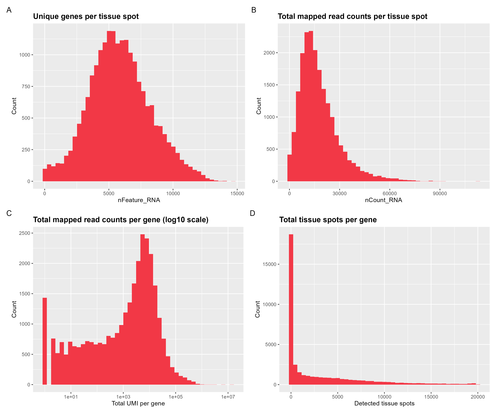
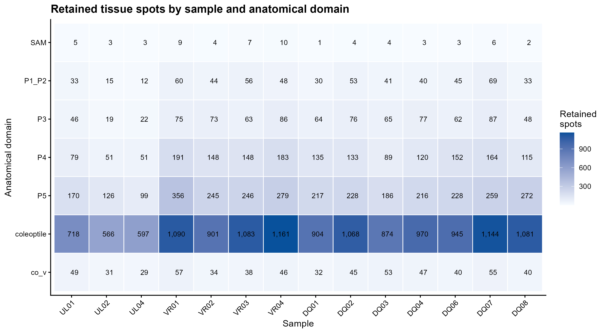
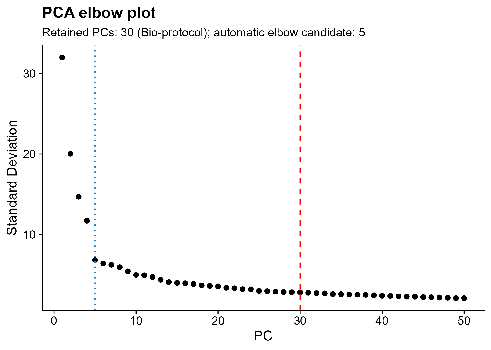
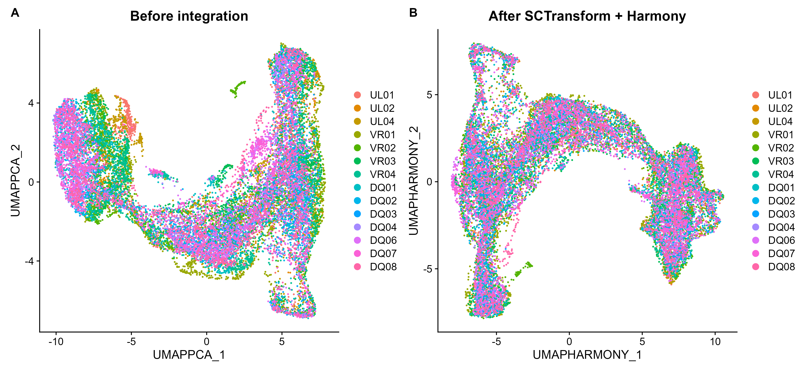

# 04. Quality control, SCTransform, PCA, Harmony integration, and clustering

This workflow reproduces the quality-control and integration steps described in the Bio-protocol manuscript for the 14 maize shoot Visium capture areas:

`UL01`, `UL02`, `UL04`, `VR01`-`VR04`, `DQ01`-`DQ04`, and `DQ06`-`DQ08`.

UL03 and DQ05 are not included because individual Seurat RDS files were not provided for these capture areas.

## Input files

Run all scripts from the repository root. The expected inputs are:

```text
data/
├── processed/
│   ├── UL01_seurat_v5.rds
│   ├── ...
│   └── DQ08_seurat_v5.rds
└── reference/
    ├── maize_mitochondrial_genes.txt
    └── maize_plastid_genes.txt
```

The mitochondrial and plastid lists contain 73 and 21 genes, respectively. They were recovered from the original analysis materials, and every listed gene is present in the current maize feature set. Explicit lists are required because these organelle genes use names such as `nad4L-XLOC-043543` and `psbC-XLOC-043729`; a generic `^MT-` or `^CP-` pattern would not identify them.

## 1. Generate QC metrics and plots

Run:

```r
source("scripts/R/04_merge_integration/00_QC_14_samples_Seurat_v5.R")
```

The script calculates the following metrics for every tissue-covered spot:

- `nFeature_RNA`: number of detected genes.
- `nCount_RNA`: total UMI count.
- `percent.mito`: percentage of UMIs assigned to the mitochondrial gene list.
- `percent.pltd`: percentage of UMIs assigned to the plastid gene list.

It also summarizes each gene using:

- `total_umi`: total UMI count across all 14 datasets.
- `detected_spots`: number of tissue spots in which the gene is detected.
- `pass_minimum_100_reads`: whether the gene has at least 100 total reads.

The manuscript reports that mitochondrial reads were below 4% and plastid reads were below 1% in most tissue-covered spots. These values are descriptive observations from the original dataset, not universal filtering thresholds. Inspect the distributions for each new dataset before deciding whether spot-level filtering is necessary.

The script produces:

```text
results/
├── figures/
│   ├── QC_spot_gene_histograms.png
│   ├── QC_violin_by_sample.png
│   ├── QC_features_vs_counts.png
│   └── QC_sample_domain_spot_counts.png
└── tables/
    ├── QC_sample_summary.csv
    ├── QC_gene_summary.csv
    └── QC_sample_domain_spot_counts.csv
```

`QC_spot_gene_histograms.png` contains:

- A: unique genes per tissue spot.
- B: total UMI counts per tissue spot.
- C: total UMI counts per gene on a log10 scale.
- D: total tissue spots per gene.

`QC_violin_by_sample.png` shows the four spot-level QC metrics separately for all 14 capture areas. `QC_features_vs_counts.png` checks the relationship between detected genes and total UMI counts.

### QC distributions across spots and genes



**Figure 1. Quality-control distributions across tissue spots and genes.** (A) Number of unique genes detected per tissue spot. (B) Total mapped UMI counts per tissue spot. (C) Total mapped UMI counts per gene on a log10 scale. (D) Number of tissue spots in which each gene was detected.

### QC metrics for individual capture areas


**Figure 2. Spot-level QC metrics across the 14 capture areas.** Violin plots show the distributions of detected genes (`nFeature_RNA`), total UMI counts (`nCount_RNA`), mitochondrial-read percentages (`percent.mito`), and plastid-read percentages (`percent.pltd`) for each sample.

### Relationship between detected genes and UMI counts


**Figure 3. Relationship between library complexity and detected features.** Each point represents one tissue-covered spot. The plot is used to identify spots with unusually low gene detection, low UMI counts, or atypical count-to-feature relationships.

### Retained spots by sample and anatomical domain

The factor levels defined for `sample_id`, `domains`, and `sample_domain` are
used to build a complete 14-sample by 7-domain count matrix. This keeps the
axes in a stable biological order and displays zero-count combinations rather
than silently dropping them.

```r
sample_domain_counts <- as.data.frame(table(
  sample_id = spot_qc$sample_id,
  domains = spot_qc$domains
))
names(sample_domain_counts)[3] <- "n_spots"

ggplot(sample_domain_counts, aes(sample_id, domains, fill = n_spots)) +
  geom_tile(colour = "white") +
  geom_text(aes(label = ifelse(n_spots > 0, n_spots, ""))) +
  scale_fill_gradient(low = "#F7FBFF", high = "#08519C") +
  labs(x = "Sample", y = "Anatomical domain") +
  theme_classic()
```



**Figure 4. Retained spot counts across samples and anatomical domains.** Each tile gives the number of curated tissue spots retained for one sample-domain combination. The numerical values are also written to `results/tables/QC_sample_domain_spot_counts.csv`.

## 2. Apply the gene-level QC rule and integrate datasets

Run:

```r
source("scripts/R/04_merge_integration/01_merge_14_samples_SCT_Harmony_Seurat_v5.R")
```

The integration script performs the following steps:

1. Loads and updates the 14 Seurat v5 objects.
2. Standardizes the expression assay name to `RNA` when necessary.
3. Adds `sample_id`, `orig.ident`, `percent.mito`, and `percent.pltd` metadata.
4. Merges the objects while retaining the 14 sample-specific RNA count layers.
5. Removes genes with fewer than 100 total reads across the combined dataset, as specified in the Bio-protocol.
6. Normalizes each sample layer using SCTransform v2 with 3,000 variable features.
7. Calculates 50 PCs for the scree/elbow diagnostic.
8. Records the automatic elbow candidate but retains PCs 1-30 for the Bio-protocol analysis.
9. Recalculates the final PCA with 30 dimensions.
10. Generates an uncorrected PCA-based UMAP.
11. Runs Seurat v5 `IntegrateLayers()` with `HarmonyIntegration` using PCs 1-30.
12. Constructs `harmony_nn` and `harmony_snn` graphs from the Harmony reduction using `FindNeighbors()`.
13. Calculates `harmony_clusters_recomputed` using `FindClusters(resolution = 2, random.seed = 1234)`.
14. Retains the published `harmony_clusters` values imported from `metadata.csv` without overwriting them.
15. Exports a recomputed-versus-published cluster contingency table and clustering log.
16. Generates a Harmony-based UMAP and a before-versus-after integration figure.
17. Plots the Harmony embedding by anatomical domain globally and separately for each sample.
18. Restores imported `harmony_clusters` as the active identity, validates the object, and saves it.

## Computational resources and troubleshooting

Computational requirements are determined more by the number of retained
spots or bins, detected genes, nonzero counts, assay layers, and temporary
matrix copies than by the compressed size of the input RDS files. The QC step
is comparatively light because it primarily loads sparse count matrices,
merges metadata, calculates summaries, and produces plots. The current 14-
sample dataset contains about 23,000 spots before domain filtering and about
20,000 retained spots. Its 14 input objects occupy approximately 0.38 GB on
disk but about 1.8 GB after loading into R. QC should normally finish on a
desktop with 16 GB RAM if other memory-intensive applications are closed;
having at least 6–8 GB of genuinely available memory is a practical target.

SCTransform, PCA, and integration require substantially more memory than QC.
SCTransform is usually the peak-memory operation because normalized values,
residuals, variable-feature matrices, and temporary copies may coexist with
the original RNA layers. PCA can also create dense working matrices, whereas
Harmony itself operates on the much smaller low-dimensional representation
and is usually not the primary memory bottleneck. For a standard Visium
analysis of roughly 20,000–25,000 combined spots, 16 GB RAM is a borderline
minimum and 32 GB is the recommended comfortable configuration. A modern
6–12-core processor is adequate; additional RAM is generally more valuable
than a very large CPU count, and a GPU is not required for this workflow. The
current final integrated object is approximately 2 GB when compressed, so at
least 10–20 GB of free working disk space should be retained for the output,
temporary files, and replacement copies.

As a general planning guide, standard Visium projects with up to approximately
25,000 combined spots usually fit comfortably within 32 GB RAM. Projects with
approximately 25,000–100,000 spots should generally be planned for 32–64 GB,
and analyses containing 100,000–500,000 observations may require 64–128 GB,
depending on matrix sparsity and the number of assays retained. Fine-bin
Visium HD data can exceed these ranges because one tissue section may contain
many more observations than a conventional Visium capture area. For the same
tissue area, halving the bin width produces approximately four times as many
bins; consequently, 8-µm bins have roughly four times the potential bin count
of 16-µm bins, and 2-µm bins have roughly 64 times the potential count of
16-µm bins before tissue masking and filtering. Whole-section analysis at the
finest HD resolution may therefore require 128–256 GB RAM or a staged strategy
that aggregates bins, analyzes biologically defined regions separately, or
uses disk-backed representations before integration. Resource-driven
aggregation or filtering should always be recorded and should not replace
biological and quality-control criteria.

If R reports that it cannot allocate a vector, closes unexpectedly, or spends
long periods paging to disk, restart R in a clean session, close browsers and
other large applications, and run QC and integration as separate clean
processes using `Rscript` with the `--vanilla` option. On a memory-limited
computer, use `conserve.memory = TRUE` in `SCTransform()` and explicitly set
`method = "glmGamPoi"` when appropriate and installed; these choices should be
recorded because they can alter runtime and memory behavior. Avoid running
several samples in parallel when RAM, rather than CPU time, is the limiting
resource. Very slow
completion after the figures have been produced may reflect serialization and
file synchronization rather than continued integration. For Dropbox or other
cloud-synchronized projects, write the large final RDS to a local nonsynced
scratch directory first, verify that it can be reopened, and then copy it into
the repository data location. A server is not necessary for the present
standard Visium dataset, but a 32-GB workstation or a 64-GB server is a safer
choice for repeated runs; a larger-memory server becomes advisable for large
multi-section or fine-bin Visium HD analyses.

## PCA selection

The elbow diagnostic evaluates PCs 1-50. The plot contains two reference lines:

- Blue dotted line: automatically detected strongest elbow.
- Red dashed line: 30 PCs retained for the Bio-protocol workflow.

Thirty PCs are retained to match the original analysis and provide a common dimensional space for integration, UMAP, and later clustering. The automatic elbow is reported separately for transparency. When applying this workflow to another dataset, users should inspect the scree plot and evaluate whether a different number of PCs better preserves biological structure without adding low-variance noise.

PCA outputs are:

```text
results/
├── figures/PCA_elbow_plot.png
├── tables/PCA_variance_explained.csv
└── logs/PCA_selection.txt
```



**Figure 5. PCA elbow diagnostic.** Variance explained is shown for PCs 1-50. The blue dotted line marks the automatically detected strongest elbow, whereas the red dashed line marks PC 30, the number of PCs retained to reproduce the Bio-protocol workflow.

## Before and after Harmony integration

`results/figures/PCA_Harmony_before_after_UMAP.png` compares:

- A: UMAP constructed from the uncorrected PCA space.
- B: UMAP constructed from the SCTransform-normalized, Harmony-corrected space.

Both panels are colored by `sample_id`. Better mixing after Harmony is consistent with reduced sample-associated variation, but biological and anatomical structure should also be checked before accepting the integration.



**Figure 6. Sample distributions before and after Harmony integration.** (A) UMAP generated from the uncorrected PCA representation after SCTransform normalization. (B) UMAP generated from the Harmony-integrated representation using PCs 1-30. Spots are colored by capture-area identity. Increased mixing of samples after integration is consistent with reduced sample-associated effects.

## Recomputed and published cluster annotations

The saved demonstration object deliberately contains two cluster fields with different purposes:

- `harmony_clusters_recomputed` is generated from the current `harmony` reduction using the `harmony_snn` graph, clustering resolution 2, algorithm 1, and random seed 1234. This field demonstrates the standard Seurat neighbor-finding and clustering workflow and is the appropriate starting point when adapting the pipeline to a new dataset.
- `harmony_clusters` is imported from `data/metadata/metadata.csv`. It contains the published cluster labels used by the marker-analysis and Figure 12 scripts. It remains the active identity in the saved demonstration object so the published results can be reproduced exactly.

Cluster numbers are arbitrary analysis labels. Resolution 2 does not guarantee 33 clusters, and a recomputed cluster with a particular number is not expected to represent the same tissue as the published cluster carrying that number. Users must characterize recomputed clusters using marker genes, structural-domain distributions, spatial positions, and histology before defining tissue supergroups.

The script records the two annotations without automatically translating between them:

```text
results/tables/harmony_clusters_recomputed_vs_published.csv
results/logs/Harmony_recomputed_clustering.txt
```

## Anatomical-domain diagnostics after Harmony

Sample mixing should not be evaluated by itself. The corrected embedding must
also preserve interpretable anatomical structure. The integration script uses
one fixed seven-color palette for both the global and sample-split views.

```r
domain_colours <- setNames(
  c("#1B9E77", "#D95F02", "#7570B3", "#E7298A",
    "#66A61E", "#E6AB02", "#A6761D"),
  allowed_domains
)

DimPlot(
  combined,
  reduction = "umap_harmony",
  group.by = "domains",
  cols = domain_colours,
  label = TRUE
)

DimPlot(
  combined,
  reduction = "umap_harmony",
  group.by = "domains",
  split.by = "sample_id",
  cols = domain_colours,
  ncol = 4
)
```

Running the complete integration script writes these diagnostics to:

- `results/figures/Harmony_UMAP_by_domain.png`, containing all retained spots in the shared corrected embedding;
- `results/figures/Harmony_UMAP_domains_by_sample.png`, containing the common embedding split by `sample_id` while retaining the same domain colors and coordinate system.

These figures should be interpreted together with spatial location and marker-gene expression. They will be embedded here after the resource-intensive integration workflow has been rerun and the generated files have been verified.

## Final output

The integrated object is saved as:

```text
data/processed/maize_shoot_14samples_SCT_harmony_seurat_v5.rds
```

The expected final reductions are:

- `pca`: 30 dimensions.
- `harmony`: 30 dimensions.
- `umap_pca`: UMAP before integration.
- `umap_harmony`: UMAP after integration.

The object retains `RNA` and `SCT` assays, the 14 sample identities, and the organelle QC metadata. The obsolete `nCount_Spatial` and `nFeature_Spatial` columns are not used.

### Verified result for the current 14-sample test run

- Tissue spots: 23,160.
- Raw merged feature set: 40,109 genes.
- Genes retained after the 100-read rule: 23,550.
- Automatic strongest elbow candidate: PC 6.
- PCs retained for the Bio-protocol analysis: PCs 1-30.
- PCA dimensions in the saved object: 30.
- Harmony dimensions in the saved object: 30.
- Recomputed clustering parameters: `harmony` reduction, dimensions 1-30, `k.param = 20`, resolution 2, algorithm 1, and random seed 1234.
- The number of recomputed clusters is recorded at runtime in `results/logs/Harmony_recomputed_clustering.txt`; it is not assumed to equal 33.
- Median mitochondrial percentage: 0.0185%; maximum: 6.61%.
- Median plastid percentage: 0%; maximum: 0.91%.
- Final Seurat object validation: passed.

## Notes for downstream analyses

- Tissue spots that overlap two or more anatomical domains should be excluded from domain-level comparisons, as described in the manuscript. They do not need to be removed from the full object before integration.
- Do not interpret spots from the same section or capture area as independent biological replicates.
- For pseudobulk or differential analyses, aggregate and model counts at the biological-replicate level rather than treating individual spots as replicates.
- Use the Harmony reduction for integrated UMAP, neighbor finding, and clustering. Use raw RNA counts for count-based differential-expression or pseudobulk models.
- For a new dataset, use `harmony_clusters_recomputed` as the starting cluster annotation and construct a new biological mapping. Use imported `harmony_clusters` only for reproducing the published demonstration.

---

## Session information

The script writes the full R session record to:

[`04_merge_integration_sessionInfo.txt`](../results/sessionInfo/04_merge_integration_sessionInfo.txt)

```r
sessionInfo()
```
