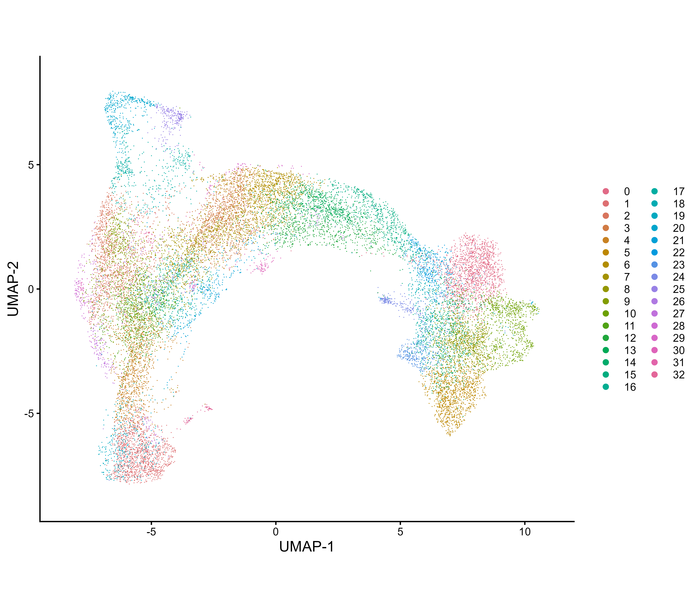
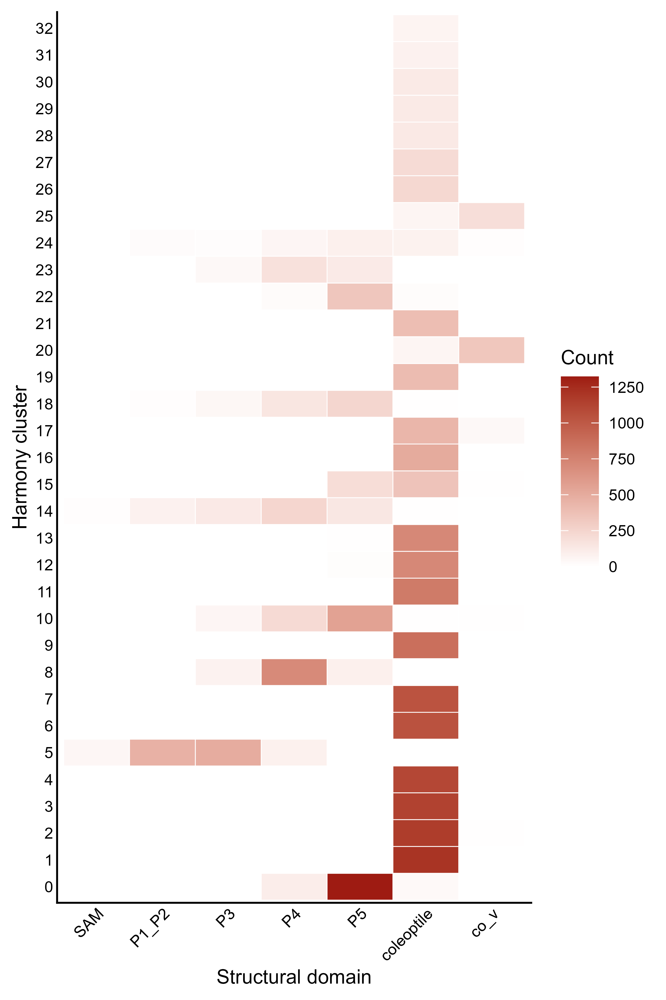
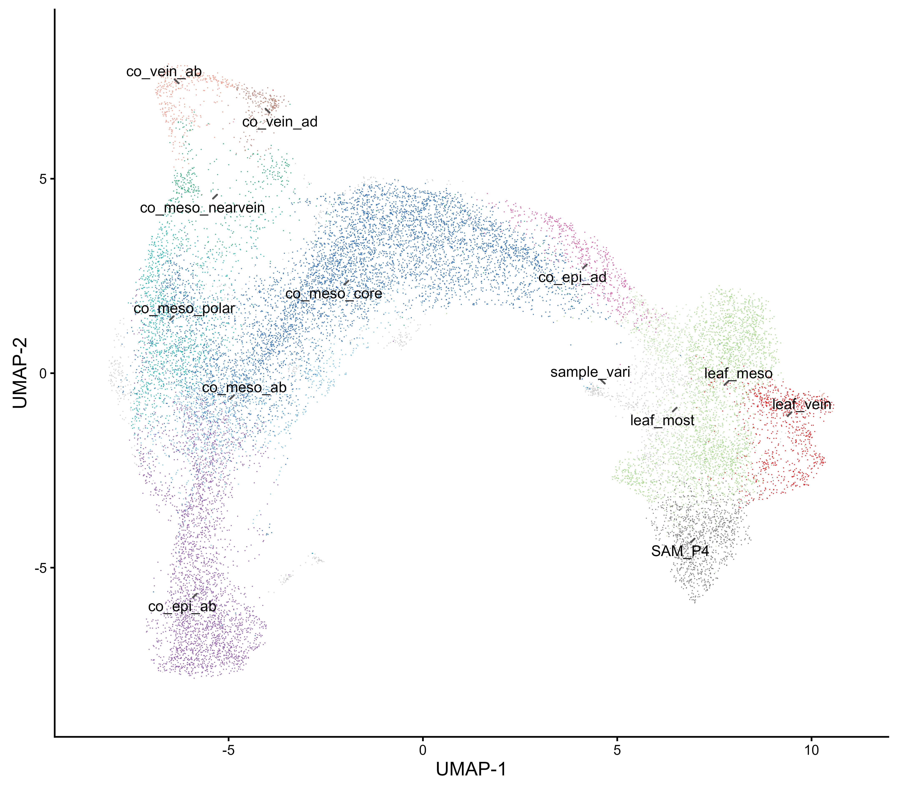
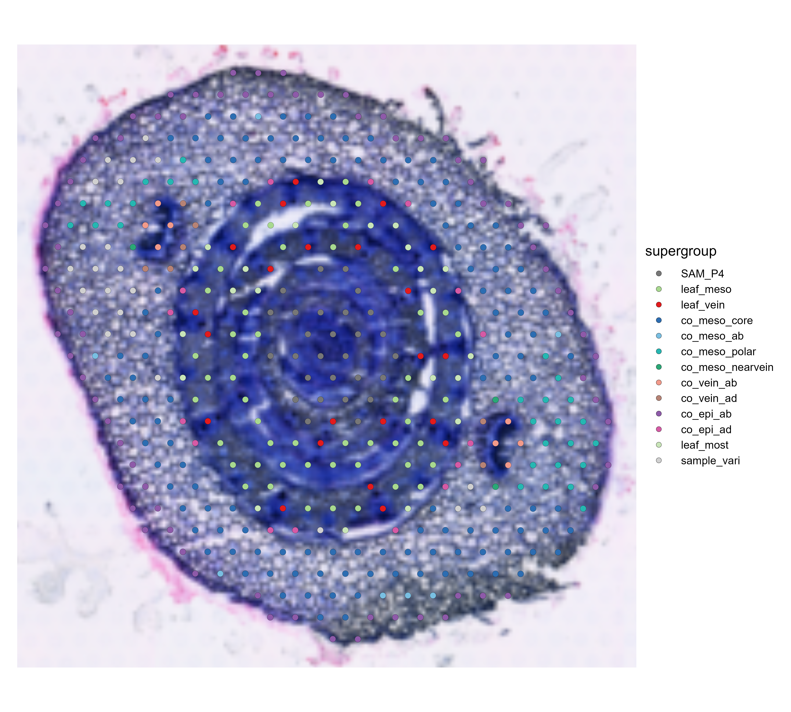

# 05. Maize shoot tissue-supergroup annotation and Figure 12

**Seurat v5 workflow for marker review, anatomical cluster annotation, and spatial visualization**

Last updated: 2026-08-29

This page documents how the 33 unsupervised Harmony clusters in the integrated maize shoot spatial-transcriptomics dataset were related to structural domains and assigned to tissue supergroups. It also reproduces Figure 12, including the cluster UMAP, cluster-by-domain heatmap, supergroup UMAP, and spatial mapping of VR03 section 2.

> **Demonstration-only warning:** Harmony cluster numbers are analysis-specific labels rather than transferable biological identities. In the supplied object, `harmony_clusters` contains the published labels imported from `metadata.csv`, whereas `harmony_clusters_recomputed` contains clusters calculated from the current Harmony graph in Step 04. This Figure 12 workflow intentionally uses imported `harmony_clusters` to reproduce the manuscript. For an independently processed, reintegrated, or reclustered dataset, users must characterize their recomputed clusters using marker genes, structural-domain distributions, spatial positions, and histology, and then create a dataset-specific cluster-to-supergroup mapping. Do not assume that cluster `0` or any other numeric label represents the same tissue across datasets or analysis runs.

The complete executable scripts are:

- [`scripts/R/05_marker_analysis/01_find_markers_harmony_clusters_SCT_Seurat_v5.R`](../scripts/R/05_marker_analysis/01_find_markers_harmony_clusters_SCT_Seurat_v5.R)
- [`scripts/R/05_marker_analysis/02_assign_tissue_supergroups_and_plot_Figure_12_Seurat_v5.R`](../scripts/R/05_marker_analysis/02_assign_tissue_supergroups_and_plot_Figure_12_Seurat_v5.R)

The examples assume that R is started from the repository root.

---

## Workflow summary

1. Load the integrated Seurat v5 object.
2. Use imported `harmony_clusters` as the published 33-cluster annotation; do not substitute `harmony_clusters_recomputed` when reproducing Figure 12.
3. Identify positive cluster markers with `FindAllMarkers()` for exploratory cluster characterization.
4. Compare cluster markers with structural-domain distributions and histological positions.
5. Assign clusters to the tissue supergroups defined in Supplementary Table 7-2.
6. Verify that all 33 clusters have exactly one assignment.
7. Generate the 33-cluster UMAP and the cluster-by-domain heatmap.
8. Generate the tissue-supergroup UMAP using the same UMAP coordinates.
9. Map the supergroups onto VR03 section 2.
10. Export individual panels and the combined Figure 12.

The original analysis defined **12 anatomical tissue supergroups**. The additional `sample_vari` category represents sample-specific variation and is not interpreted as a tissue identity. Therefore, 13 colors are displayed when `sample_vari` is included.

---

## Inputs and outputs

### Input object

```text
data/processed/maize_shoot_14samples_SCT_harmony_seurat_v5.rds
```

The verified input contains:

| Item | Value |
|---|---:|
| Tissue spots | 20,090 |
| Retained genes | 23,048 |
| Harmony clusters | 33 (`0-32`) |
| Structural domains | 7 |
| UMAP reduction | `umap_harmony` |
| Active identity | `harmony_clusters` |

The seven structural domains are `SAM`, `P1_P2`, `P3`, `P4`, `P5`, `coleoptile`, and `co_v`.

### Output tables

- [`results/tables/cluster_to_tissue_supergroup.csv`](../results/tables/cluster_to_tissue_supergroup.csv)
- [`results/tables/cluster_domain_counts.csv`](../results/tables/cluster_domain_counts.csv)
- `results/tables/top10_markers_per_cluster_for_annotation.csv`, generated when the significant marker table is available

### Output figures

- [`Figure_12_A_clusters_UMAP.png`](../results/figures/Figure_12/Figure_12_A_clusters_UMAP.png)
- [`Figure_12_B_cluster_domain_heatmap.png`](../results/figures/Figure_12/Figure_12_B_cluster_domain_heatmap.png)
- [`Figure_12_C_supergroups_UMAP.png`](../results/figures/Figure_12/Figure_12_C_supergroups_UMAP.png)
- [`Figure_12_D_VR03_section2_spatial.png`](../results/figures/Figure_12/Figure_12_D_VR03_section2_spatial.png)
- [`Figure_12_composite.png`](../results/figures/Figure_12/Figure_12_composite.png)
- [`Figure_12_composite.pdf`](../results/figures/Figure_12/Figure_12_composite.pdf)

---

## Identify exploratory cluster markers

Run the marker-analysis script first:

```r
source(file.path(
  "scripts", "R", "05_marker_analysis",
  "01_find_markers_harmony_clusters_SCT_Seurat_v5.R"
))
```

The cluster-marker screen uses the following parameters:

```r
markers_SCT_all <- FindAllMarkers(
  object = combined,
  assay = "SCT",
  only.pos = TRUE,
  min.pct = 0.25,
  logfc.threshold = 0.25,
  test.use = "wilcox",
  return.thresh = 1
)

significant_markers_SCT_all <- markers_SCT_all |>
  dplyr::filter(p_val_adj < 0.05)
```

The rationale is:

- `only.pos = TRUE` retains genes enriched in each cluster;
- `min.pct = 0.25` requires detection in at least 25% of spots in either comparison group;
- `logfc.threshold = 0.25` removes very small effects before testing;
- the Wilcoxon rank-sum test is used for exploratory spot-level marker screening;
- adjusted *p* < 0.05 defines the retained exploratory marker table.

These spot-level results support cluster annotation. They are not a substitute for replicate-level differential-expression analysis because spots from the same section, capture area, or seedling are not independent biological replicates. Formal anatomical-domain comparisons should use raw-count pseudobulk profiles aggregated by biological replicate and domain, with |log2 fold change| > 1 and FDR < 0.05.

---

## Assign clusters to tissue supergroups

The assignments were recovered from Supplementary Table 7-2, titled *The transfer of the unsupervised clusters to the supergroups of spatial information*.

The table below is retained to reproduce the published maize shoot demonstration. It is not a universal annotation key. Users analyzing their own data should replace these assignments only after evaluating their own cluster markers and spatial/anatomical correspondence.

| Cluster | Spatial interpretation | Supergroup |
|---:|---|---|
| 0 | P5, most cell types except mature veins | `leaf_meso` |
| 1 | Coleoptile abaxial epidermis | `co_epi_ab` |
| 2 | Coleoptile mesophyll at the polar axis between vein and epidermis | `co_meso_polar` |
| 3 | Coleoptile cortex mesophyll at the equatorial axis | `co_meso_core` |
| 4 | Coleoptile abaxial epidermis | `co_epi_ab` |
| 5 | SAM-P4, almost all cells | `SAM_P4` |
| 6 | Coleoptile cortex mesophyll at the equatorial axis | `co_meso_core` |
| 7 | Coleoptile cortex mesophyll at the equatorial axis | `co_meso_core` |
| 8 | SAM-P4, almost all cells except mature veins | `leaf_meso` |
| 9 | Coleoptile cortex mesophyll, uneven | `co_meso_core` |
| 10 | P3-P5, mostly near mature veins | `leaf_vein` |
| 11 | Coleoptile mesophyll next to the abaxial epidermis | `co_meso_ab` |
| 12 | Coleoptile cortex mesophyll, uneven | `co_meso_core` |
| 13 | Coleoptile cortex mesophyll, uneven | `co_meso_core` |
| 14 | P1-P5, most cells, uneven | `leaf_most` |
| 15 | Coleoptile adaxial epidermis | `co_epi_ad` |
| 16 | Coleoptile cortex mesophyll, uneven | `co_meso_core` |
| 17 | Coleoptile mesophyll surrounding veins | `co_meso_nearvein` |
| 18 | P4-P5 mesophyll, sample-dependent | `sample_vari` |
| 19 | Coleoptile abaxial epidermis | `co_epi_ab` |
| 20 | Abaxial side of the coleoptile vein, corresponding to phloem | `co_vein_ab` |
| 21 | Coleoptile mesophyll next to the abaxial epidermis | `co_meso_ab` |
| 22 | P4-P5, most mesophyll, uneven | `leaf_most` |
| 23 | P4, most mesophyll except veins | `leaf_meso` |
| 24 | Mesophyll, sample-dependent | `sample_vari` |
| 25 | Adaxial side of the coleoptile vein, corresponding to xylem | `co_vein_ad` |
| 26 | Coleoptile cortex mesophyll, uneven | `co_meso_core` |
| 27 | Coleoptile abaxial epidermis | `co_epi_ab` |
| 28 | Not spatially specific | `sample_vari` |
| 29 | Not spatially specific | `sample_vari` |
| 30 | Not spatially specific | `sample_vari` |
| 31 | Not spatially specific | `sample_vari` |
| 32 | Not spatially specific | `sample_vari` |

The executable script stores this table as a data frame and performs three checks before annotation:

```r
stopifnot(
  nrow(cluster_to_supergroup) == 33L,
  identical(cluster_to_supergroup$cluster, as.character(0:32)),
  setequal(
    unique(cluster_to_supergroup$supergroup),
    supergroup_levels
  )
)
```

The mapping is added to the in-memory Seurat object without changing the active identity:

```r
active_ident_before <- Idents(combined)

supergroup_lookup <- setNames(
  cluster_to_supergroup$supergroup,
  cluster_to_supergroup$cluster
)

combined$supergroup <- factor(
  unname(supergroup_lookup[as.character(combined$harmony_clusters)]),
  levels = supergroup_levels
)

stopifnot(identical(
  unname(as.character(Idents(combined))),
  unname(as.character(active_ident_before))
))
```

The script does not save a duplicate copy of the approximately 2.17-GB integrated object. It writes the compact cluster-to-supergroup table and figure outputs instead.

---

## Panel A: 33 unsupervised clusters

Panel A displays all tissue-covered spots using the existing `umap_harmony` reduction and colors them by `harmony_clusters`.



The Figure 12 workflow uses the imported published cluster annotation rather than `harmony_clusters_recomputed`. Step 04 performs standard neighbor finding and clustering separately, but its recomputed labels are not automatically translated to the published cluster numbers.

---

## Panel B: cluster distributions across structural domains

Panel B counts spots in every cluster-domain combination.

```r
domain_levels <- c(
  "SAM", "P1_P2", "P3", "P4", "P5", "coleoptile", "co_v"
)

cluster_domain_counts <- as.data.frame(table(
  cluster = factor(
    as.character(combined$harmony_clusters),
    levels = as.character(0:32)
  ),
  domain = factor(combined$domains, levels = domain_levels)
))
```



Color intensity represents the number of spots. Structural domains are shown in developmental order, and clusters are ordered numerically from 0 at the bottom to 32 at the top.

This heatmap should be interpreted together with marker genes and histology. A cluster can span more than one structural domain because transcriptional transitions are gradual and a Visium spot can contain multiple cell types.

---

## Panel C: tissue-supergroup UMAP

Panel C uses exactly the same UMAP coordinates as panel A but colors spots by `supergroup`.



The following display controls are placed near the beginning of the plotting script:

```r
umap_flip_x <- FALSE
umap_flip_y <- FALSE
umap_rotation_degrees <- 0
umap_x_limits <- c(-8.5, 11.0)
umap_y_limits <- c(-8.5, 8.5)
```

The default orientation and limits match the current manuscript figure. If UMAP is recalculated and appears mirrored or rotated, these parameters can adjust the presentation without changing cluster membership, gene expression, or biological interpretation.

---

## Panel D: VR03 section-2 spatial mapping

Panel D is restricted to `section_id == "VR03_S2"` rather than the generic `Section2` label, which occurs in multiple samples.

```r
vr03_section2_cells <- rownames(combined[[]])[
  as.character(combined$section_id) == "VR03_S2"
]

vr03_section2 <- subset(
  combined,
  cells = vr03_section2_cells
)
```

The validated selection contains **414 tissue spots**, all belonging to sample VR03 and section `VR03_S2`.

```r
pD <- SpatialDimPlot(
  object = vr03_section2,
  images = "VR03",
  group.by = "supergroup",
  cols = supergroup_colors,
  image.scale = "lowres",
  image.alpha = 1,
  pt.size.factor = 1.75,
  crop = TRUE
)
```



The combined Seurat object contains both low- and high-resolution scale information, but the stored low-resolution raster is correctly aligned with the spot coordinates. Selecting `image.scale = "hires"` causes visible image-spot misregistration in this object; therefore, panel D intentionally uses `lowres`.

---

## Combined Figure 12


The figure is exported as a 600-dpi PNG and a vector PDF. Individual panels are also saved so their sizes can be adjusted during manuscript assembly without rerunning the analysis.

Run the complete annotation and figure workflow with:

```r
source(file.path(
  "scripts", "R", "05_marker_analysis",
  "02_assign_tissue_supergroups_and_plot_Figure_12_Seurat_v5.R"
))
```

If the marker table has already been generated, the script also writes the ten highest-ranking positive markers per cluster to facilitate manual comparison with histology and structural-domain labels.

---

## Suggested figure legend

**Figure 12. Unsupervised clustering and anatomical identification of maize shoot tissue supergroups.** (A) UMAP of tissue-covered spots after SCTransform normalization and Harmony integration, colored by 33 unsupervised clusters. (B) Distribution of the clusters across seven structural domains. Color intensity indicates the number of spots in each cluster-domain combination. (C) UMAP showing the assignment of clusters to 12 anatomical tissue supergroups based on transcriptional similarity, marker-gene expression, structural-domain distribution, and histological correspondence. The `sample_vari` category represents sample-specific variation and is not considered a tissue supergroup. (D) Spatial mapping of tissue supergroups onto VR03 section 2; colors correspond to those in panel C. Abbreviations: ad, adaxial; ab, abaxial; co, coleoptile; co_v, coleoptile vein; epi, epidermis; meso, mesophyll. Adapted from Figure 4A-B and Supplementary Figure 13A and D of Wu et al. [1].

---

## Interpretation and reproducibility notes

- Cluster annotation should combine marker genes, histological position, structural-domain distribution, and spatial coherence.
- The cluster-to-supergroup mapping is specific to this integrated dataset and should not be transferred to a newly clustered dataset without validation.
- For a new dataset, start from `harmony_clusters_recomputed`, characterize each cluster biologically, and replace the demonstration mapping with a dataset-specific table.
- `sample_vari` should not be interpreted as a biological tissue identity.
- The Harmony embedding is used for clustering and visualization, not as input for replicate-level differential-expression testing.
- Spots are subsamples within biological replicates and should not be treated as independent experimental units for inferential domain comparisons.
- Record the R version, Seurat version, repository commit, and source workbook version when releasing the final analysis.

The tested workflow assigned all **20,090 spots** from all **33 clusters** without missing supergroup values and preserved `harmony_clusters` as the active Seurat identity.

---

## Session information

The script writes the full R session record to:

[`05_marker_analysis_sessionInfo.txt`](../results/sessionInfo/05_marker_analysis_sessionInfo.txt)

```r
sessionInfo()
```
