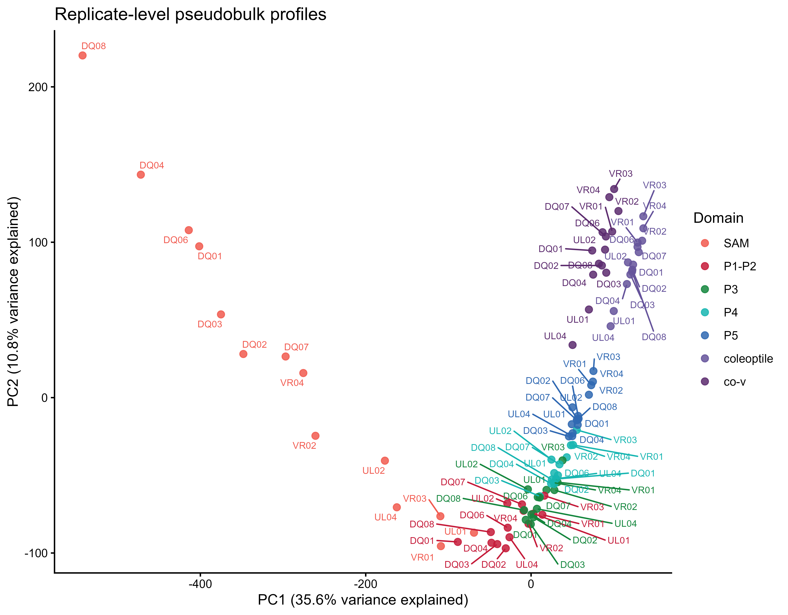
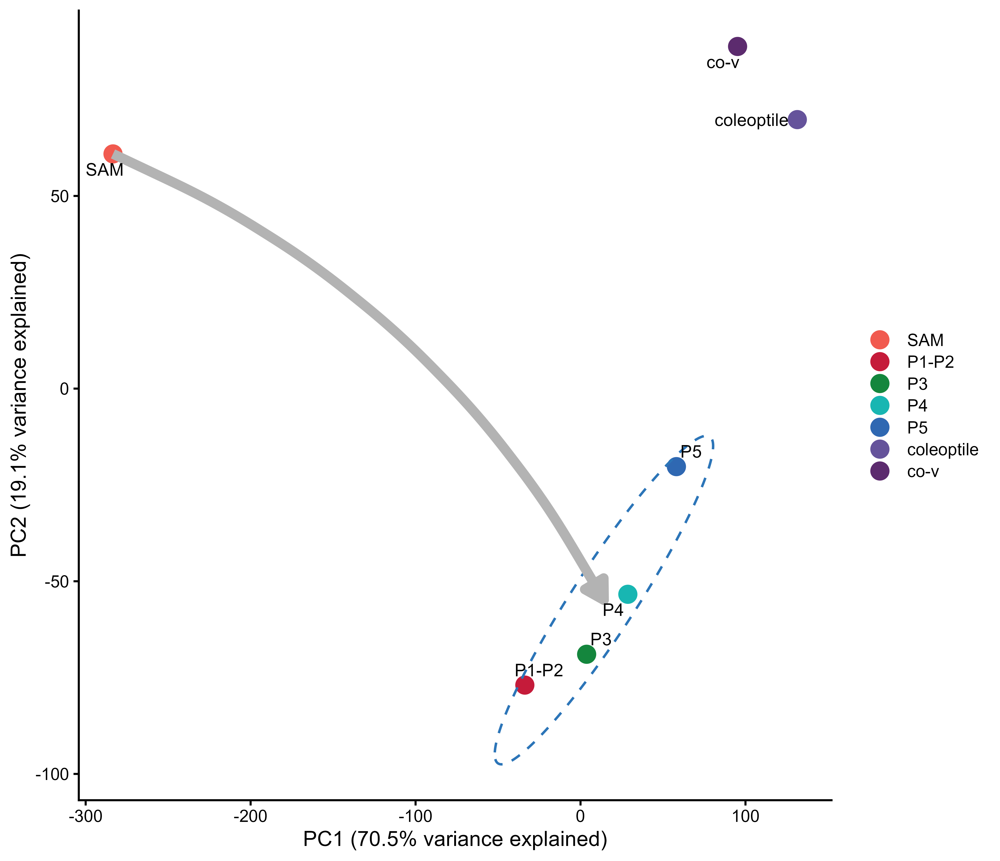
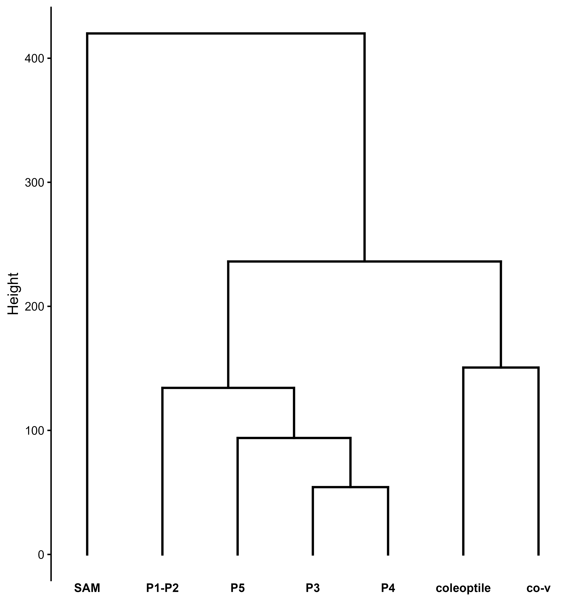
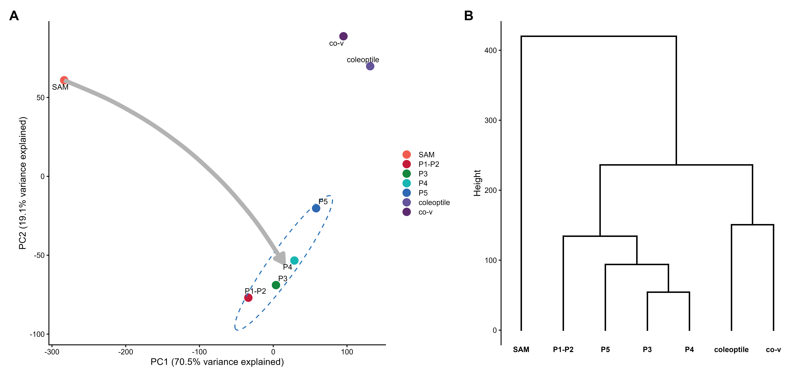

# 06. Pseudobulk profiles of maize shoot structural domains

**Replicate-aware Seurat v5 and edgeR workflow for Figure 13**

Last updated: 2026-08-25

This workflow reconstructs the pseudobulk analysis used to compare gene-expression profiles among the maize shoot apical meristem (`SAM`), leaf primordia (`P1_P2`, `P3`, `P4`, and `P5`), coleoptile, and coleoptile vein (`co_v`). Raw UMI counts are first aggregated by biological replicate and structural domain. TMM normalization and log2 counts per million (log2 CPM) transformation are then performed at the pseudobulk-library level.

The complete executable script is:

- [`scripts/R/06_pseudobulk_analysis/01_pseudobulk_structural_domains_Figure_13_Seurat_v5.R`](../scripts/R/06_pseudobulk_analysis/01_pseudobulk_structural_domains_Figure_13_Seurat_v5.R)

Run the script from the repository root:

```r
source(file.path(
  "scripts", "R", "06_pseudobulk_analysis",
  "01_pseudobulk_structural_domains_Figure_13_Seurat_v5.R"
))
```

---

## Experimental unit

The analysis uses `sample_id` as the biological-replicate identifier. The current dataset contains 14 biological replicates. Multiple tissue spots and serial sections belonging to the same sample are subsamples of that replicate and are not treated as independent experimental units.

For every observed `sample_id × domain` combination, the script sums raw UMI counts from all contributing spots into one pseudobulk library. Thus, one replicate may contribute profiles to several domains, but each replicate-domain combination contributes only one pseudobulk library.

The seven structural domains are processed in the following order:

```r
domain_levels <- c(
  "SAM", "P1_P2", "P3", "P4", "P5", "coleoptile", "co_v"
)
```

The replicate-level profiles are retained for quality assessment and any subsequent statistical modeling. Domain-level mean profiles are calculated only for descriptive visualization in Figure 13.

---

## Input

```text
data/processed/maize_shoot_14samples_SCT_harmony_seurat_v5.rds
```

The input Seurat v5 object must contain:

- an `RNA` assay with raw `counts` layers;
- `sample_id`, identifying the biological replicate;
- `domains`, containing one of the seven curated structural-domain labels.

The script uses raw RNA counts rather than the `SCT` assay or Harmony coordinates. Harmony is appropriate for integrated visualization and clustering, but it does not replace raw counts for pseudobulk analysis.

---

## 1. Aggregate raw UMI counts

The sample-specific RNA count layers are joined, and a sparse spot-by-library membership matrix is constructed. Matrix multiplication then sums raw UMI counts for each replicate-domain combination without converting the full spot-level expression matrix to a dense matrix.

Conceptually, for gene *g*, biological replicate *r*, and structural domain *d*:

\[
Y_{grd} = \sum_{s \in (r,d)} Y_{gs}
\]

where \(Y_{gs}\) is the raw UMI count for gene *g* in tissue spot *s*. Spots and serial sections do not enter the analysis as separate biological replicates.

The script exports:

- [`results/tables/Figure_13/pseudobulk_library_metadata.csv`](../results/tables/Figure_13/pseudobulk_library_metadata.csv), listing the biological replicate, domain, number of contributing spots, library size, and normalization factor for every pseudobulk library;
- `results/tables/Figure_13/pseudobulk_raw_counts.csv.gz`, containing replicate-domain raw counts.

---

## 2. Apply TMM normalization and calculate log2 CPM

Pseudobulk libraries can differ substantially in sequencing depth and RNA composition. The workflow therefore uses edgeR to calculate trimmed mean of M-values (TMM) normalization factors across the replicate-domain libraries:

```r
dge <- edgeR::DGEList(counts = pseudobulk_counts)
dge <- edgeR::normLibSizes(dge, method = "TMM")
pseudobulk_log2cpm <- edgeR::cpm(
  dge,
  log = TRUE,
  prior.count = 1
)
```

`normLibSizes()` is the current edgeR name for the function previously called `calcNormFactors()`. The script includes a fallback for older edgeR releases. The output of `cpm(..., log = TRUE)` is log2 counts per million. The prior count stabilizes values for genes with very low counts; it is not an additional read-count filter.

The normalized replicate-domain profiles are exported as:

```text
results/tables/Figure_13/pseudobulk_TMM_log2CPM.csv.gz
```

---

## 3. Evaluate biological-replicate variation

PCA is first performed on all replicate-domain log2 CPM profiles. This diagnostic is used to determine whether replicates from the same structural domain show broadly consistent expression patterns and to identify sample-associated outliers.



The corresponding coordinates are saved as:

```text
results/tables/Figure_13/replicate_PCA_coordinates.csv
```

Replicate dispersion should be inspected before domain means are interpreted. A single sample that is separated from all other replicates may indicate differences in tissue composition, section placement, library quality, or residual technical variation.

No inferential test is performed at the spot level. If formal differential-expression testing is required, the replicate-domain raw-count matrix should be analyzed with a replicate-aware count model and relevant covariates.

---

## 4. Calculate descriptive domain means

For each structural domain, the script calculates the row mean of the replicate-level TMM log2 CPM profiles:

```r
domain_mean_log2cpm <- vapply(
  domain_levels,
  function(current_domain) {
    domain_columns <- group_metadata$group_id[
      group_metadata$domain == current_domain
    ]
    rowMeans(pseudobulk_log2cpm[, domain_columns, drop = FALSE])
  },
  numeric(nrow(pseudobulk_log2cpm))
)
```

Each available biological replicate receives equal weight in its domain mean, regardless of the number of spots it contributed. These seven mean profiles are used only for the descriptive PCA and hierarchical clustering shown in Figure 13; they are not independent replicates and are not used for inferential testing.

The domain means are exported as:

```text
results/tables/Figure_13/domain_mean_TMM_log2CPM.csv.gz
```

---

## 5. PCA of domain-level mean profiles

PCA is performed on the transposed domain-mean matrix using centered, unscaled log2 CPM values:

```r
domain_pca <- prcomp(
  t(domain_mean_log2cpm),
  center = TRUE,
  scale. = FALSE
)
```



The four developing-leaf domains are outlined for visual reference. The gray arrow indicates the proposed developmental progression from SAM toward the developing leaf profiles; it is an interpretive annotation and is not calculated as a trajectory.

The PCA coordinates and exact variance-explained values are saved in:

```text
results/tables/Figure_13/domain_mean_PCA_coordinates.csv
```

---

## 6. Hierarchical clustering of domain-level means

The same seven domain-mean profiles are compared using Euclidean distance and complete-linkage hierarchical clustering:

```r
domain_distance <- dist(
  t(domain_mean_log2cpm),
  method = "euclidean"
)

domain_hclust <- hclust(
  domain_distance,
  method = "complete"
)
```



Branch height represents gene-expression dissimilarity. The analysis describes similarity among the seven domain means and does not provide an inferential test of differences between domains.

---

## Figure 13



**Figure 13. Pseudobulk gene-expression profiles of maize shoot domains.** Raw UMI counts were aggregated by biological replicate and structural domain, normalized using TMM, and transformed to log2 counts per million. Equal-weight replicate means were then calculated for descriptive domain-level visualization. (A) PCA showing the relationships among the shoot apical meristem (SAM), developing leaf primordia (P1-P5), coleoptile, and coleoptile vein (co-v). The dashed outline identifies developing leaf profiles, and the gray arrow indicates the proposed developmental progression. (B) Complete-linkage hierarchical clustering of Euclidean distances among the same domain-level mean profiles; branch height represents gene-expression dissimilarity. These panels are descriptive and are not used for inferential testing. Adapted from Figure 3A-B of Wu et al. [1].

The script exports both raster and vector versions:

```text
results/figures/Figure_13/Figure_13_composite.png
results/figures/Figure_13/Figure_13_composite.pdf
```

---

## 7. Optional comparison with scRNA-seq reference profiles

To compare the spatial domain means with scRNA-seq reference profiles, set `scrna_reference_file` near the beginning of the script:

```r
scrna_reference_file <- file.path(
  "data", "reference",
  "scRNAseq_reference_pseudobulk_log2CPM.csv"
)
```

The first CSV column must contain gene identifiers, and the remaining columns must contain normalized scRNA-seq reference profiles. The script intersects the gene sets and calculates Spearman correlations between spatial domains and scRNA-seq reference profiles:

```r
spearman_correlations <- cor(
  spatial_profiles[common_genes, , drop = FALSE],
  scrna_profiles[common_genes, , drop = FALSE],
  method = "spearman",
  use = "pairwise.complete.obs"
)
```

The optional result is written to:

```text
results/tables/Figure_13/spatial_domain_vs_scRNAseq_Spearman_correlations.csv
```

Correlation is calculated only across genes present in both datasets. Gene identifiers and expression units should be harmonized before interpreting the result.

---

## Output summary

```text
results/
├── figures/
│   └── Figure_13/
│       ├── pseudobulk_replicate_PCA_diagnostic.png
│       ├── Figure_13_A_domain_mean_PCA.png
│       ├── Figure_13_B_domain_mean_hierarchical_clustering.png
│       ├── Figure_13_composite.png
│       └── Figure_13_composite.pdf
├── tables/
│   └── Figure_13/
│       ├── pseudobulk_library_metadata.csv
│       ├── pseudobulk_raw_counts.csv.gz
│       ├── pseudobulk_TMM_log2CPM.csv.gz
│       ├── domain_mean_TMM_log2CPM.csv.gz
│       ├── replicate_PCA_coordinates.csv
│       ├── domain_mean_PCA_coordinates.csv
│       └── spatial_domain_vs_scRNAseq_Spearman_correlations.csv (optional)
└── sessionInfo/
    └── 06_pseudobulk_analysis_sessionInfo.txt
```

The script verifies that adding and joining assay layers does not change the active Seurat identity. It does not save a duplicate copy of the integrated Seurat object.

---

## Session information

The script writes the full R session record to:

[`06_pseudobulk_analysis_sessionInfo.txt`](../results/sessionInfo/06_pseudobulk_analysis_sessionInfo.txt)

```r
sessionInfo()
```
