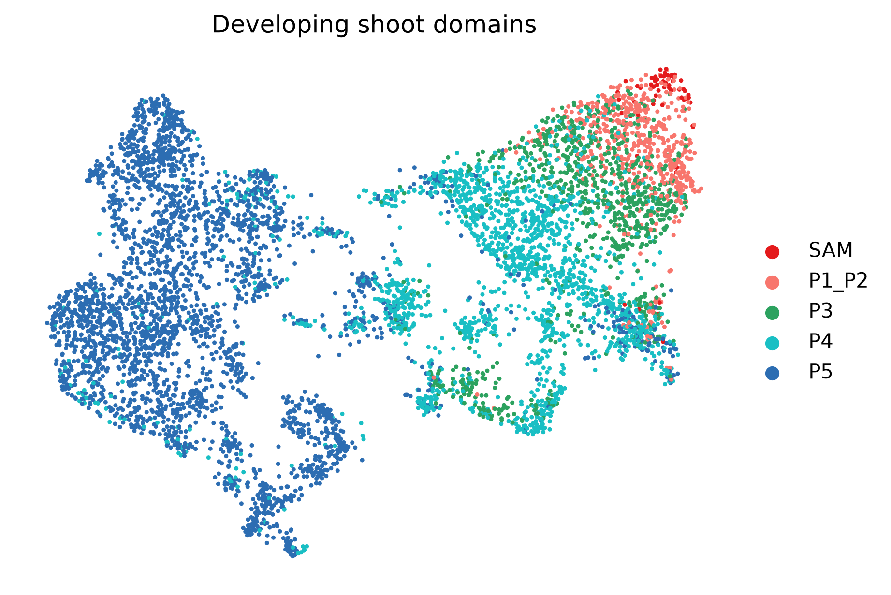
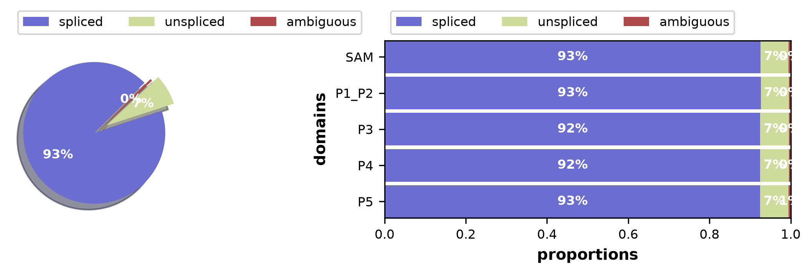
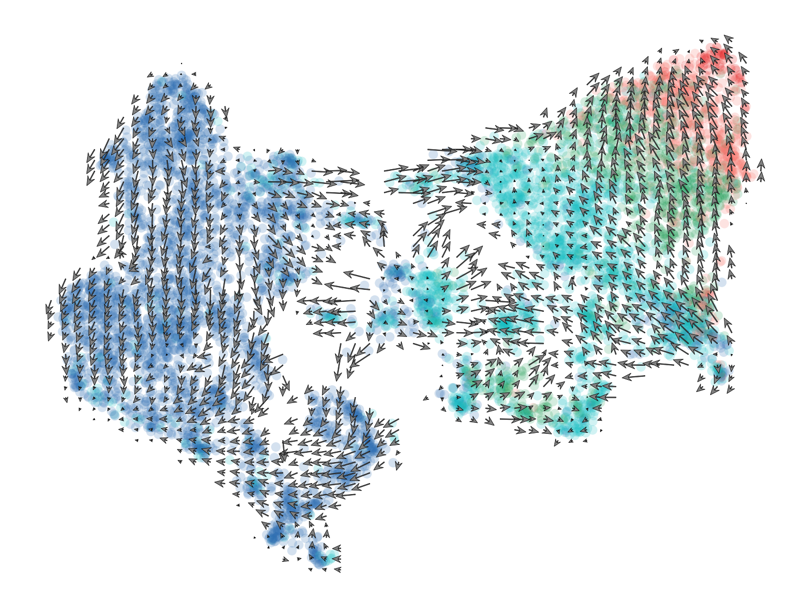
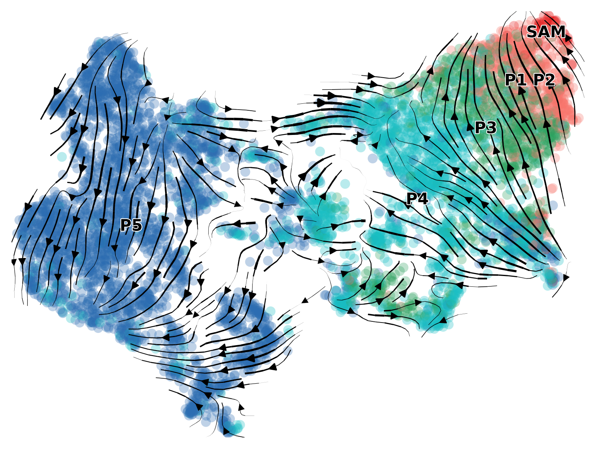

# 08. Dynamical RNA velocity of maize embryonic leaves

**Seurat-to-AnnData transfer, Velocyto loom integration, and Figure 10B**

This workflow estimates RNA velocity across five embryonic-leaf structural
domains:

`SAM → P1_P2 → P3 → P4 → P5`

It preserves the PCA, UMAP coordinates, and spot metadata from
`XGE202122_S5_subset_embleaf_harmony_join.rds`, then adds spliced and
unspliced UMI layers from the 14 Velocyto loom files. The final velocity field
is estimated using scVelo's dynamical model, as specified in the manuscript.

The workflow scripts are:

- [`01_export_Seurat_for_scVelo.R`](../scripts/R/08_RNA_velocity/01_export_Seurat_for_scVelo.R)
- [`01_scvelo_dynamical_RNA_velocity.py`](../scripts/python/08_RNA_velocity/01_scvelo_dynamical_RNA_velocity.py)

## Workflow organization

### Step -1: Export Seurat data for Python

The R script reads:

```text
data/processed/XGE202122_S5_subset_embleaf_harmony_join.rds
```

It exports:

```text
data/processed/RNA_velocity/seurat_export/
├── counts.mtx
├── features.csv
├── spot_metadata.csv
├── pca.csv
├── umap.csv
└── export_manifest.txt
```

The exported count matrix contains raw RNA UMIs. `spot_metadata.csv` preserves
the Seurat metadata and canonical barcodes. `pca.csv` contains the existing
Seurat PCA, and `umap.csv` contains the exact `umap.harmony` coordinates used
for the manuscript geometry.

The deposited Seurat object uses section-level values such as `UL01_S2` in
one metadata field. For loom matching, the exporter writes the canonical
capture identifier (`UL01`) as `sample_id` and preserves the section-level
value as `sample_id_original`.

The exporter does not modify the active Seurat identity. It verifies that
`Idents()` is unchanged before finishing.

### Step 0: Use existing spliced and unspliced matrices

The BAM-to-loom Velocyto step is not rerun. One deposited loom file per sample
is placed in:

```text
data/raw/loom/
```

The canonical 14 samples are:

```text
UL01  UL02  UL04
VR01  VR02  VR03  VR04
DQ01  DQ02  DQ03  DQ04  DQ06  DQ07  DQ08
```

Each loom file must contain `spliced` and `unspliced` layers. An `ambiguous`
layer is retained when available but is not required for velocity inference.

### Step 1: Reconstruct AnnData and merge loom layers

The Python script reconstructs an AnnData object from the Matrix Market count
matrix and CSV files. It then:

1. converts each Velocyto barcode to the canonical Seurat format;
2. matches spots by exact barcode;
3. matches genes using the stable Velocyto gene accession when available;
4. reorders the loom matrices to the Seurat spot and gene order; and
5. adds `spliced`, `unspliced`, and optional `ambiguous` layers.

The canonical barcode format is:

```text
<10x-barcode>-1_1_<sample-number>
```

The fixed sample order is:

```text
UL01=1, UL02=2, UL04=3,
VR01=4, VR02=5, VR03=6, VR04=7,
DQ01=8, DQ02=9, DQ03=10, DQ04=11,
DQ06=12, DQ07=13, DQ08=14
```

The completed local run matched all 6,392 Seurat spots and 39,756 genes:

```text
matched_spots          6392
missing_seurat_spots      0
shared_genes          39756
required_layers       spliced, unspliced
```

## Preprocessing parameters

The installed scVelo 0.3.4 no longer accepts `n_top_genes` through
`filter_and_normalize()`. The script therefore performs the equivalent steps
explicitly:

```python
scv.pp.filter_genes(
    adata,
    min_shared_counts=20,
)

scv.pp.normalize_per_cell(adata)
sc.pp.log1p(adata)

sc.pp.highly_variable_genes(
    adata,
    n_top_genes=2000,
    flavor="seurat",
    subset=True,
)
```

Neighborhood moments use the first 30 PCA dimensions exported from Seurat and
30 neighboring spots:

```python
scv.pp.moments(
    adata,
    n_pcs=30,
    n_neighbors=30,
    use_rep="X_pca",
)
```

The principal parameters are:

| Parameter | Default | Purpose |
|---|---:|---|
| `min_shared_counts` | 20 | Removes genes with insufficient combined spliced/unspliced evidence |
| `n_top_genes` | 2,000 | Retains informative genes for kinetic fitting |
| `n_pcs` | 30 | Defines the PCA dimensions used for neighborhoods |
| `n_neighbors` | 30 | Defines the local neighborhood used to calculate moments |
| `max_iter` | 20 | Maximum iterations for dynamical parameter recovery |
| `n_jobs` | 1 | Portable default for dynamical fitting and velocity graph calculation |
| random seed | 0 | Used when PCA or UMAP must be recalculated |

By default, the script uses the exported Seurat PCA and UMAP. It does not
recalculate Harmony. `--recompute-pca` and `--use-harmony` are optional
adaptations for a new dataset and are not used for manuscript reproduction.

## Dynamical velocity model

The manuscript describes the dynamical model. The correct calculation order
is:

```python
scv.tl.recover_dynamics(
    adata,
    n_top_genes=2000,
    max_iter=20,
    n_jobs=1,
)

scv.tl.velocity(
    adata,
    mode="dynamical",
)

scv.tl.velocity_graph(
    adata,
    n_jobs=1,
)

scv.tl.velocity_confidence(adata)
```

The earlier exploratory script calculated stochastic velocity and then called
`recover_dynamics(mode="dynamical")`. That call is invalid because
`recover_dynamics()` has no `mode` argument. Recovering dynamical parameters
also does not replace an existing stochastic velocity layer. A dynamical
analysis must explicitly rerun `velocity(mode="dynamical")` and then rebuild
the velocity graph, as done here.

The stochastic model can be useful as a faster sensitivity analysis, but it is
not the primary model reported for this workflow.

## Running the workflow

Start RStudio at the repository root and export the Seurat data:

```r
setwd("C:/Users/user/Dropbox/Git/maize_shoot_data_process_v2")

source(
  "scripts/R/08_RNA_velocity/01_export_Seurat_for_scVelo.R"
)
```

Open Miniforge Prompt and run:

```bat
cd /d C:\Users\user\Dropbox\Git\maize_shoot_data_process_v2
conda activate maize-shoot-v2

python scripts\python\08_RNA_velocity\01_scvelo_dynamical_RNA_velocity.py --validate-files-only

python scripts\python\08_RNA_velocity\01_scvelo_dynamical_RNA_velocity.py
```

The validation-only mode checks the Seurat export, all 14 loom filenames, file
sizes, and the presence of retained spots without loading the loom matrices or
fitting the model.

## Outputs

### Processed AnnData objects

```text
data/processed/RNA_velocity/
├── maize_shoot_SAM_P1_P2_P3_P4_P5_Seurat_export.h5ad
└── maize_shoot_SAM_P1_P2_P3_P4_P5_scvelo_dynamical.h5ad
```

The first file is the Seurat-to-AnnData checkpoint. The second contains the
matched Seurat expression matrix, spot metadata, exported PCA and UMAP,
spliced/unspliced layers, moments, fitted dynamical parameters, velocities,
velocity graph, and confidence measurements.

### Tables and logs

```text
results/tables/08_RNA_velocity/
├── loom_metadata_barcode_matching.csv
├── Seurat_loom_merge_summary.csv
├── spliced_unspliced_QC_by_sample_domain.csv
├── RNA_velocity_spot_metadata.csv
├── RNA_velocity_run.log
└── python_package_versions.json
```

The recorded successful run completed with:

```text
Seurat export             6,392 spots x 40,109 genes
Seurat/loom merge         6,392 spots x 39,756 shared genes
Velocity model            2,000 highly variable genes
PCA dimensions            30
Velocity mode             dynamical
```

## Figures

### Figure 10A: structural domains on the Seurat Harmony UMAP



The five structural domains are displayed using the `umap.harmony`
coordinates exported from the Seurat object. These coordinates are preserved
throughout the loom merge and velocity analysis.

### Spliced and unspliced proportions



This diagnostic summarizes the relative abundance of spliced and unspliced
transcripts across the five structural domains. Low-unspliced groups are
reported but are not automatically removed.

### Figure 10B: dynamical RNA-velocity vectors



Arrows represent the dynamical RNA-velocity field projected onto the preserved
Seurat Harmony UMAP. Spots are colored by structural domain.

### Dynamical velocity stream diagnostic



The stream representation is a smoothed visualization of the same dynamical
velocity graph. It should be interpreted together with the arrow grid,
spliced/unspliced QC, anatomical-domain progression, and Monocle pseudotime.

## Suggested figure legend

**Figure 10A and B. RNA velocity across maize embryonic-leaf structural
domains.** (A) Harmony UMAP of spatial transcriptomic spots assigned to the
shoot apical meristem (SAM) and successive developing leaf domains (P1-P2, P3,
P4, and P5). Coordinates and anatomical-domain annotations were transferred
from the processed Seurat object. (B) RNA-velocity vectors estimated from
Velocyto-derived spliced and unspliced UMI counts using scVelo's dynamical
model and projected onto the same UMAP. Arrow direction indicates the inferred
local transcriptional transition. Spots spanning multiple structural domains
and spots belonging to the outer protective tissues were excluded.

## Interpretation and limitations

- RNA-velocity arrows represent model-based local transcriptional predictions,
  not direct observations of cell or tissue movement.
- The dynamical model estimates gene-specific transcription, splicing, and
  degradation parameters and is more computationally demanding than the
  stochastic model.
- Sparse unspliced counts can reduce velocity reliability. Inspect the
  proportion and per-sample/domain QC tables before biological interpretation.
- The Visium spots contain mixtures of multiple cells. RNA velocity therefore
  describes changes in spot-level transcriptional states rather than literal
  single-cell lineage relationships.
- The UMAP coordinates were transferred to reproduce the manuscript geometry.
  They should not be reused automatically for a new dataset.
- Agreement with the SAM-to-P5 anatomical sequence and the independently
  estimated Monocle trajectory provides supporting evidence, but neither
  method alone establishes developmental causality.

## Troubleshooting

### No SAM-P5 spots are found

The deposited Seurat object may use values such as `UL01_S2` in `sample_id`.
The current exporter and Python script canonicalize loom matching to `UL01`
while preserving the original value as `sample_id_original`.

### `Column(s) ['Barcode'] do not exist`

The current QC implementation counts an index-derived temporary spot field and
therefore accepts either `Barcode` or `barcode` metadata conventions.

### `normalize_per_cell() got an unexpected keyword argument 'n_top_genes'`

This indicates scVelo 0.3.4, whose convenience wrapper differs from older
tutorials. The current script uses explicit filtering, normalization, log
transformation, and Scanpy highly-variable-gene selection and does not pass
`n_top_genes` to `filter_and_normalize()`.

### The analysis is slow

`recover_dynamics()` is normally the longest step. Keep `n_jobs = 1` for a
portable laptop run. Increase it only after confirming available memory and
CPU resources. The complete fitted H5AD is saved for reuse.

## Session information

The R exporter writes its full session record to:

[`08_RNA_velocity_Seurat_export_sessionInfo.txt`](../results/sessionInfo/08_RNA_velocity_Seurat_export_sessionInfo.txt)

```r
sessionInfo()
```

The Python workflow writes exact package versions to:

[`python_package_versions.json`](../results/tables/08_RNA_velocity/python_package_versions.json)

The successful local run used Python 3.11.16, anndata 0.12.19, Scanpy 1.11.5,
scVelo 0.3.4, NumPy 2.4.6, pandas 2.3.3, SciPy 1.17.1, matplotlib 3.11.1,
and loompy 3.0.8.
