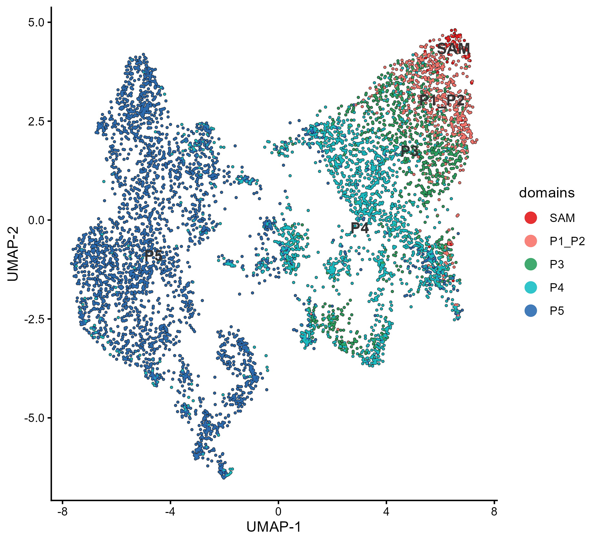
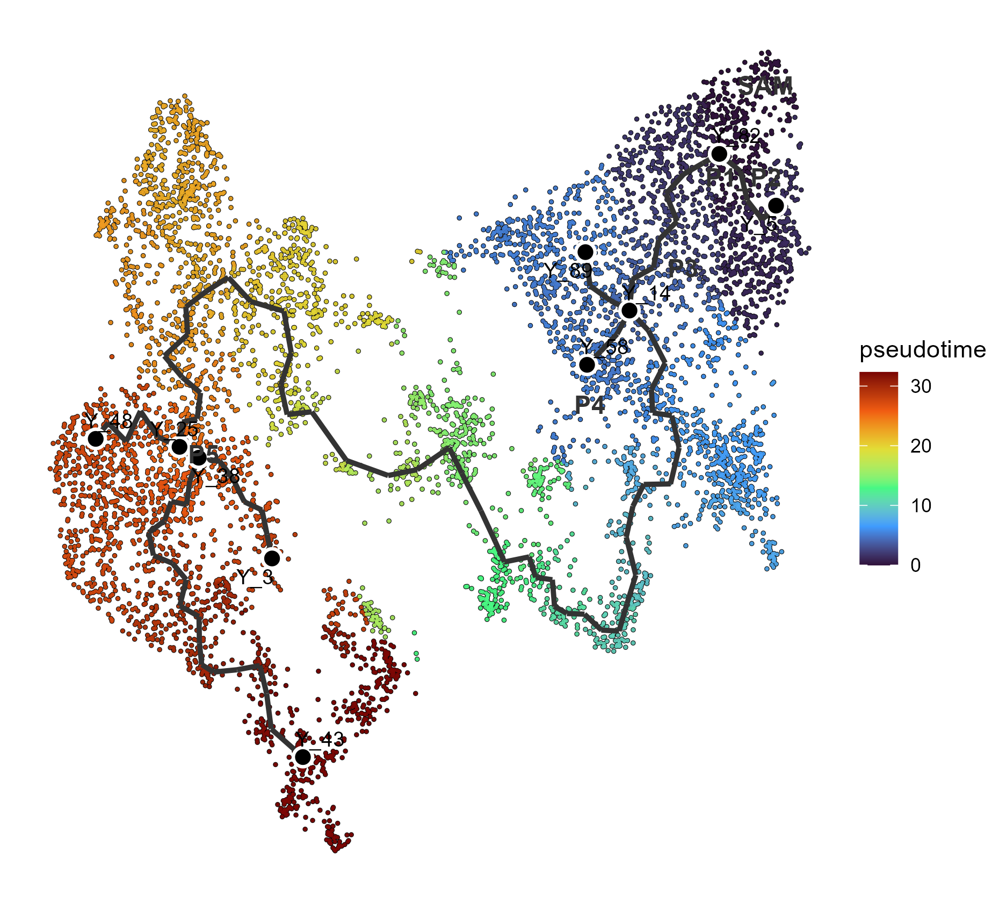
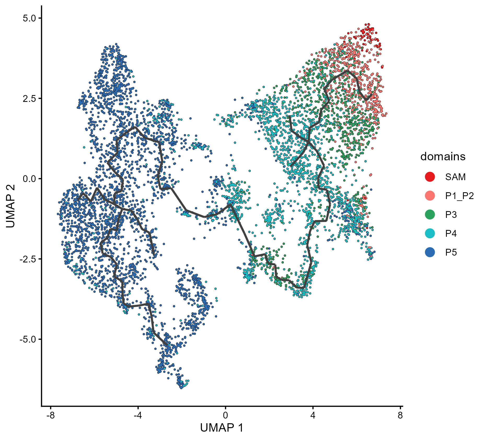

# 09. Monocle 3 pseudotime analysis of maize embryonic leaves

**Transferred Seurat UMAP, interactive root selection, and Figures 10A and 10C**

This workflow estimates pseudotime across five developing-shoot domains:

`SAM → P1_P2 → P3 → P4 → P5`

The analysis uses the 14 biological replicates while retaining only curated,
non-overlapping spots assigned to these five domains. The biological starting
state is expected to lie in the shoot apical meristem (`SAM`). By default,
Monocle 3 opens an interactive Shiny GUI in which the user manually selects one
or more principal graph nodes as the developmental starting point. The selected
node identifiers are saved for reproducible non-interactive reruns.

The executable script is:

[`01_monocle3_pseudotime_14_samples_Figure_10C.R`](../scripts/R/09_monocle3_pseudotime/01_monocle3_pseudotime_14_samples_Figure_10C.R)

## Inputs

### Individual Seurat objects

The following 14 Seurat v5 objects are required in `data/processed/`:

```text
UL01_seurat_v5.rds    UL02_seurat_v5.rds    UL04_seurat_v5.rds
VR01_seurat_v5.rds    VR02_seurat_v5.rds    VR03_seurat_v5.rds
VR04_seurat_v5.rds    DQ01_seurat_v5.rds    DQ02_seurat_v5.rds
DQ03_seurat_v5.rds    DQ04_seurat_v5.rds    DQ06_seurat_v5.rds
DQ07_seurat_v5.rds    DQ08_seurat_v5.rds
```

Each object must contain an `RNA` assay with one raw `counts` layer.

### Seurat coordinate-source object

```text
data/processed/XGE202122_S5_subset_embleaf_harmony_join.rds
```

For manuscript reproduction, the script transfers the `umap.harmony`
coordinates from this 6,392-spot embryonic-leaf Seurat object into Monocle 3.
This makes the spot geometry of Figures 10A and 10C match the reference Seurat
UMAP. Coordinates are reordered by barcode before assignment; the script stops
if any retained Monocle spot is absent from the coordinate source.

### Curated spot metadata

```text
data/metadata/metadata.csv
```

Required columns are:

- `Barcode`: canonical spot identifier;
- `sample_id`: one of the 14 biological replicates;
- `domains`: anatomical domain; and
- `section_id`: unique physical-section identifier used for alignment.

The script retains only `SAM`, `P1_P2`, `P3`, `P4`, and `P5`. Spots spanning
multiple anatomical domains and spots from the protective coleoptile tissues
are excluded from this developmental trajectory.

## Barcode standardization

The 14 individual objects may use sample-prefixed barcodes. Before combining
the Monocle datasets, the script converts every name to the canonical format:

```text
<10x-barcode>-1_1_<sample-number>
```

The fixed sample-number order is:

```text
UL01=1, UL02=2, UL04=3,
VR01=4, VR02=5, VR03=6, VR04=7,
DQ01=8, DQ02=9, DQ03=10, DQ04=11,
DQ06=12, DQ07=13, DQ08=14
```

The script stops if canonicalization creates duplicates or if no curated spots
match an individual object.

## Analysis workflow

### 1. Construct and combine Monocle datasets

Raw RNA counts, curated spot metadata, and gene identifiers are used to create
one `cell_data_set` per biological replicate. The 14 objects are combined with:

```r
cds <- combine_cds(
  cds_list,
  keep_all_genes = TRUE,
  cell_names_unique = TRUE,
  sample_col_name = "sample_id_from_combine",
  keep_reduced_dims = FALSE
)
```

Raw total UMI counts are calculated for every retained spot. Spots with fewer
than 100 UMIs are removed, reproducing the original `umi_cutoff = 100`
criterion.

### 2. Preprocess and align by physical section

The combined dataset is log-normalized and processed using 100 principal
components:

```r
cds <- preprocess_cds(
  cds,
  method = "PCA",
  num_dim = 100,
  norm_method = "log"
)
```

Batch alignment uses `section_id`, which uniquely identifies each physical
section:

```r
cds <- align_cds(
  cds,
  preprocess_method = "PCA",
  alignment_group = "section_id"
)
```

Repeated positional labels such as `Section1` are not used as the alignment
group because the same label can occur in different capture areas.

### 3. Transfer the Seurat Harmony UMAP for Figures 10A and 10C

The default setting is:

```r
use_seurat_reference_umap <- TRUE
seurat_umap_reduction <- "umap.harmony"
```

The script reads the two-dimensional Harmony UMAP from
`XGE202122_S5_subset_embleaf_harmony_join.rds`, matches it to retained Monocle
barcodes, and installs it as the Monocle `UMAP` reduction before clustering and
graph learning. This reproduces the coordinate system of the reference panels.

For a new dataset, an independent Monocle UMAP can instead be calculated from
the aligned PCA coordinates by changing:

```r
use_seurat_reference_umap <- FALSE
```

In that mode, the script uses cosine distance, 15 neighbors, and
`umap.min_dist = 0.1`.

### 4. Learn a developmental trajectory

Monocle clustering is calculated on the selected UMAP. A single trajectory
graph is then learned across the five developmental domains:

```r
cds <- cluster_cells(cds, reduction_method = "UMAP")

cds <- learn_graph(
  cds,
  use_partition = FALSE,
  close_loop = FALSE
)
```

`use_partition = FALSE` allows one graph to connect the SAM and developing-leaf
regions. `close_loop = FALSE` retains a tree-like trajectory.

### 5. Select the root manually and calculate pseudotime

The default setting is:

```r
root_selection_mode <- "interactive"
```

After graph learning, the script prints and saves a domain-colored guide with
labeled principal graph points. It then calls `order_cells()` without supplying
`root_pr_nodes` or `root_cells`. In an interactive RStudio session, this opens
Monocle 3's **Choose your root nodes** Shiny GUI.

In the GUI:

1. Inspect the domain-colored guide and locate the SAM region.
2. Click a node, or brush one or more nodes and click **Choose/unchoose**.
3. Confirm that the intended root nodes are selected.
4. Click **Done**.

The selected identifiers are saved to:

```text
results/tables/09_monocle3_pseudotime/
└── Monocle3_selected_root_principal_nodes.csv
```

To repeat the analysis with the same root without reopening the GUI, set:

```r
root_selection_mode <- "saved"
```

An `automatic_sam` mode is retained as an optional non-interactive fallback,
but it is not the default. Any root choice is an explicit biological
assumption. Changing the selected root changes pseudotime direction;
pseudotime is a relative graph distance rather than chronological time.

## Run the workflow

Restart R to obtain a clean session, open the repository root, and run:

```r
setwd("C:/Users/user/Dropbox/Git/maize_shoot_data_process_v2")

source(
  "scripts/R/09_monocle3_pseudotime/01_monocle3_pseudotime_14_samples_Figure_10C.R"
)
```

Run this script with `source()` in RStudio for the first analysis. Running it
with `Rscript` is non-interactive and cannot display the root-selection GUI.
After an interactive run has saved the selected node identifiers, `Rscript`
can be used with `root_selection_mode <- "saved"`.

Do not source `_verify_monocle_runtime.R`. That name referred to a temporary
diagnostic file and is not part of the repository workflow.

## Outputs

### Processed Monocle object

```text
data/processed/monocle3/
├── maize_shoot_SAM_P1_P2_P3_P4_P5_monocle3_before_root_selection.rds
└── maize_shoot_SAM_P1_P2_P3_P4_P5_monocle3_pseudotime.rds
```

### Tables

```text
results/tables/09_monocle3_pseudotime/
├── Seurat_to_Monocle_barcode_matching.csv
├── retained_spots_by_sample_and_domain.csv
├── Monocle3_spot_pseudotime_and_metadata.csv
├── Monocle3_selected_root_principal_nodes.csv
└── Monocle3_pseudotime_parameters.csv
```

`Monocle3_spot_pseudotime_and_metadata.csv` contains the retained barcode,
sample and section metadata, structural domain, total UMI count, pseudotime,
and UMAP coordinates.

### Figures

```text
results/figures/09_monocle3_pseudotime/
├── Figure_10A_Seurat_Harmony_UMAP_by_domain.png
├── Figure_10A_Seurat_Harmony_UMAP_by_domain.pdf
├── Figure_10C_monocle3_pseudotime.png
├── Figure_10C_monocle3_pseudotime.pdf
├── Monocle3_root_selection_guide.png
└── Monocle3_trajectory_by_domain.png
```

## Figure 10A



Spots are shown using the `umap.harmony` coordinates transferred from
`XGE202122_S5_subset_embleaf_harmony_join.rds` and are colored by the five
embryonic-leaf domains. No Monocle graph is displayed in panel A.

## Figure 10C

The following image appears after the workflow has completed:



Spots are colored from low to high pseudotime. The dark line represents the
principal graph. Principal points are labeled to document the graph structure,
and anatomical-domain labels are positioned at the median UMAP coordinates for
SAM, P1_P2, P3, P4, and P5.

### Anatomical-domain diagnostic



This diagnostic should be inspected to confirm that the selected root is in the
expected SAM region and that increasing pseudotime broadly follows the proposed
progression toward later leaf primordia.

## Suggested figure legend

**Figure 10A and C. UMAP domains and pseudotime trajectory of maize embryonic
leaf development.** (A) Harmony UMAP of spatial transcriptomic spots assigned
to the shoot apical meristem (SAM) and successive leaf primordia (P1–P2, P3,
P4, and P5), colored by structural domain. The coordinates were transferred
from `XGE202122_S5_subset_embleaf_harmony_join.rds`. (C) Monocle 3 trajectory
learned and displayed on the same UMAP coordinates. The biological starting
node was selected manually from the SAM region using the Monocle 3
root-selection GUI. Colors indicate increasing pseudotime, the dark line
represents the learned principal graph, and numbered labels identify principal
graph points.

## Interpretation and reproducibility notes

- The starting node is selected manually. SAM is the biologically expected
  root for manuscript reproduction, but users must justify the root for their
  own experiment.
- Spots from the same section or capture area are subsamples, not independent
  biological replicates.
- The trajectory describes transcriptional continuity and does not establish
  lineage relationships or elapsed developmental time by itself.
- Harmony UMAP transfer is used to reproduce the manuscript coordinate system.
  New datasets should be reprocessed and evaluated independently.
- Principal-point numbers are graph identifiers and are not anatomical-stage
  labels.
- The random seed is recorded as `2026`; numerical results may still vary with
  changes in Monocle 3, UMAP, or graph-learning dependencies.

## Troubleshooting

### S4 object cannot be coerced to a character vector

The script explicitly uses `SeuratObject::Assays()`,
`SeuratObject::Layers()`, and `SeuratObject::LayerData()` to avoid a namespace
collision with Bioconductor assay accessors. Restart R and source the current
repository script if this error appears.

### The coordinate-source object lacks `umap.harmony`

Download the deposited coordinate-source object or set:

```r
use_seurat_reference_umap <- FALSE
```

The latter calculates a new Monocle UMAP and will not reproduce the exact
Figure 10A/10C coordinate system.

### The root-selection GUI does not open

Confirm that the script is being sourced in an interactive RStudio session and
that `root_selection_mode <- "interactive"`. The GUI uses `shiny`; install it
if necessary. A non-interactive `Rscript` process must use a previously saved
root or the optional `automatic_sam` mode.

### Infinite pseudotime values

Infinite values indicate spots that are not reachable from the selected root.
Confirm that `use_partition = FALSE`, inspect the domain-colored graph, and
verify that the chosen root belongs to the intended connected trajectory.

## Session information

The script writes the full R session record to:

[`09_monocle3_pseudotime_sessionInfo.txt`](../results/sessionInfo/09_monocle3_pseudotime_sessionInfo.txt)

```r
sessionInfo()
```
