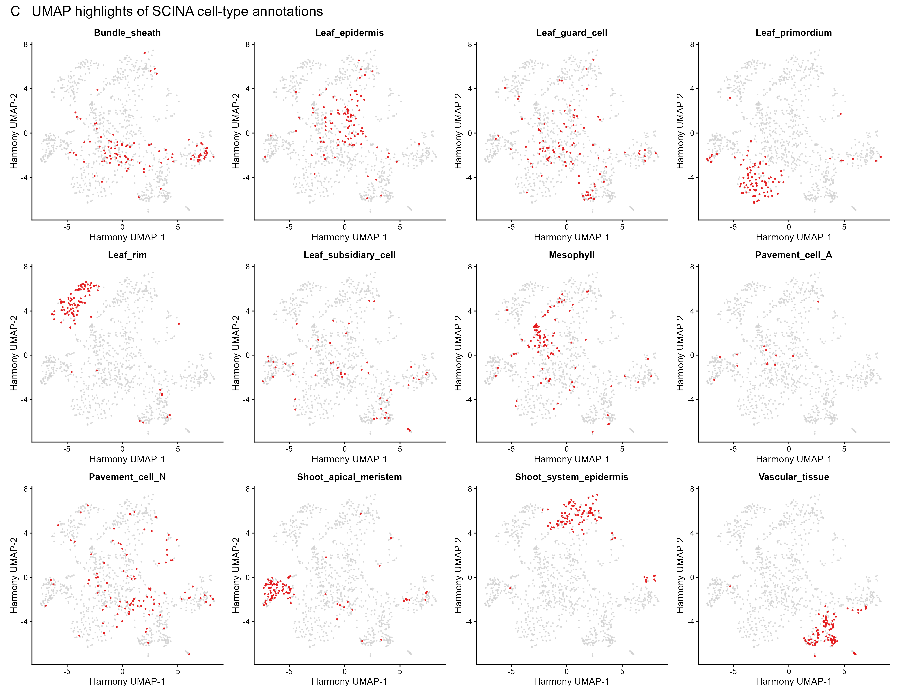

# 10. Maize shoot scRNA-seq reference: SCINA cell-type annotation

This workflow assigns maize shoot scRNA-seq cell identities using SCINA v1.2.0 and validates the annotations on the Harmony UMAP. The analysis script is:

[`03_scRNA_celltype_annotation_SCINA_Seurat_v5.R`](../scripts/R/10_scRNA_reference_integration/03_scRNA_celltype_annotation_SCINA_Seurat_v5.R)

## Input files

The complete annotation run requires:

- `data/processed/sc_merged_filter_SCT2_inte.rds`
- `data/metadata/scRNA_reference/SCINA_marker_table.csv`

The marker genes are provided in **Supplementary Table 9, “Marker genes for cell types in the maize leaf and developing shoot, derived from the Single Cell Plant Database.”** Export this table as `SCINA_marker_table.csv`. The CSV must contain `gene_id` and `cell_type`. It may also contain `avg_log2FC`, `avg_logFC`, `marker_rank`, or `rank`; the first available column is used to prioritize markers when a signature contains more than 100 genes.

If the marker CSV is absent, the script can regenerate Figure C from an existing annotation field such as `celltype_scina_histo` in `sce_ref.rds`. This plot-only route does not rerun SCINA or write a new annotated RDS.

## Signature preparation

1. Read the marker table and convert gene and cell-type identifiers to character values.
2. Retain marker genes present in the SCT expression matrix.
3. Remove duplicated markers within each cell type.
4. Remove genes assigned to more than one cell type.
5. Retain no more than 100 ranked markers per cell type.
6. Remove cell types with fewer than two remaining markers.

Only the retained marker genes are converted to a dense matrix for SCINA. This substantially reduces memory use compared with converting the complete SCT matrix.

## SCINA parameters

The seed is set to 1. SCINA v1.2.0 is run with:

```r
SCINA::SCINA(
  expression_matrix,
  signatures,
  max_iter = 100,
  convergence_n = 10,
  sensitivity_cutoff = 1,
  rm_overlap = TRUE,
  allow_unknown = TRUE
)
```

The maximum-posterior label is assigned to each cell. Calls with a maximum posterior probability below 0.5 are changed to `Unknown`. The annotations are stored in `celltype_scina`, and confidence values are stored in `celltype_scina_max_posterior`.

The original active identities are retained. A new annotated object is written to:

`data/processed/sc_merged_filter_SCT2_inte_SCINA.rds`

## Figure C: UMAP validation



**Figure C.** Harmony-corrected UMAP overlays validating the SCINA cell-type assignments. Each panel highlights one annotated cell type in red, while all other cells are shown in gray. The displayed categories include shoot system epidermis, pavement cells, leaf epidermis, mesophyll, leaf rim, shoot apical meristem, vascular tissue, bundle sheath, leaf primordium, guard cells, and subsidiary cells when present in the analyzed object.

The currently embedded Figure C was generated from the validated `celltype_scina_histo` annotations in `sce_ref.rds`. To rerun SCINA on the complete reference, supply the marker CSV and load the full Seurat object in RStudio before sourcing the script.

## Output tables

The workflow writes the following records to `results/tables/11_scRNA_SCINA_annotation/`:

- `SCINA_marker_signatures_retained.csv` when SCINA is run
- `SCINA_shared_markers_removed.csv` when SCINA is run
- `SCINA_cell_assignments.csv` when SCINA is run
- `SCINA_celltype_summary.csv`
- `SCINA_run_record.csv`

## Run

From the repository root in RStudio:

```r
source("scripts/R/10_scRNA_reference_integration/03_scRNA_celltype_annotation_SCINA_Seurat_v5.R")
```

## Session information

The runtime record is written to:

[`11_scRNA_SCINA_annotation_sessionInfo.txt`](../results/sessionInfo/11_scRNA_SCINA_annotation_sessionInfo.txt)

```r
sessionInfo()
```
