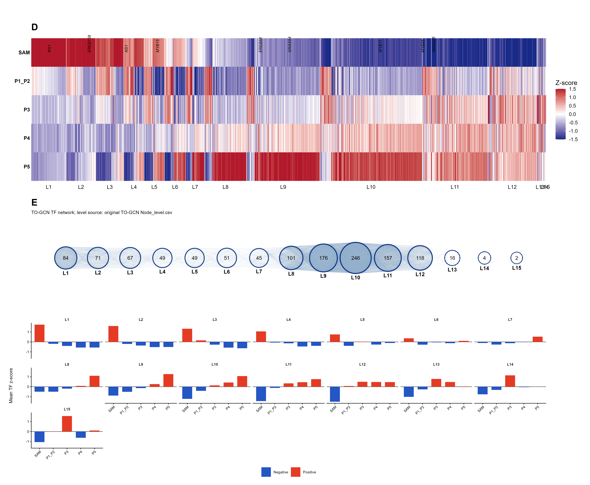

# 11. Time-ordered gene coexpression network of the embryonic leaf

This module reconstructs the transcription-factor time-order analysis across
five adjacent embryonic-leaf domains:

`SAM -> P1_P2 -> P3 -> P4 -> P5`

It generates the TF heatmap corresponding to panel D, the level network and
mean profiles corresponding to panel E, and gene lists for level-specific GO
enrichment.

## Scope and interpretation

The structural domains are treated as an ordered developmental series, not as
five independent biological time-course experiments. Raw RNA UMIs are summed
within each domain and divided by the number of retained spots in that domain.
This gives mean UMI per spot and is equivalent to averaging raw counts once.
The values must not be divided by the spot count a second time.

The network is calculated from the unscaled five-domain profiles. Gene-wise
z-scores are produced only for heatmap display. With only five ordered
features, Pearson correlations can be sensitive to noise; the inferred graph
should therefore be treated as a descriptive reconstruction and validated
biologically.

## Required inputs

- `data/processed/XGE202122_S5_subset_embleaf_harmony_join.rds`
- One TF reference described in
  [`data/reference/TO_GCN/README.md`](../data/reference/TO_GCN/README.md)
- Git, Bash, and a C++ compiler such as `g++`
- R packages: Seurat, SeuratObject, Matrix, dplyr, tidyr, ggplot2, and
  patchwork; `readxl` is additionally required when the recovered workbook is
  used

The source Seurat object must contain raw RNA count layers and a structural
domain field named `domains`, `domain`, or `structural_domain`.

## Step 1: prepare expression matrices

Run from the repository root in RStudio:

```r
source("scripts/R/11_TO_GCN/01_prepare_TO_GCN_inputs_from_Seurat_v5.R")
```

The script:

1. retains SAM, P1_P2, P3, P4, and P5 spots;
2. sums raw RNA UMIs by domain;
3. divides each domain sum by its spot count;
4. keeps expressed genes and excludes constant profiles only from correlation
   input, because their Pearson correlation is undefined;
5. intersects the expressed features with the maize TF annotation;
6. writes headerless five-feature matrices required by the original C++
   programs; and
7. writes the seed list. The recovered candidate seed is
   `Zm00001eb222520` (`mybr90`); change `seed_gene_ids` in the script when a
   different biologically justified seed is required.

Important outputs are stored in `results/tables/11_TO_GCN/input/`:

- `All_gene_expression.tsv`
- `TF_expression.tsv`
- `seeds.txt`
- `domain_spot_counts.csv`
- mean-UMI and TF z-score tables

## Step 2: compile and run the original TO-GCN code

In Git Bash:

```bash
bash scripts/shell/11_TO_GCN/01_compile_TO_GCN_single.sh
bash scripts/shell/11_TO_GCN/02_run_TO_GCN_single.sh 0.95
```

The first command downloads the [original TO-GCN
repository](https://github.com/petitmingchang/TO-GCN), compiles
`Cutoff_single`, `GCN_single`, and `TO-GCN_single`, and records the exact Git
commit. The second command runs the five-feature analysis. The archived study
used a positive PCC cutoff of 0.95. `Cutoff_single` also writes the empirical
PCC distribution; users should inspect that distribution and calibrate the
cutoff for another dataset instead of assuming 0.95 is universally optimal.

The original programs write:

- `PCC_histogram.tsv`: PCC distribution used to examine the cutoff;
- `C1+.csv`: positively coexpressed TF-target pairs;
- `Node_level.csv`: seed-based breadth-first TF levels; and
- `Node_relation.csv`: TF-TF relations retained in the traversed network.

These files are stored under
`results/tables/11_TO_GCN/original_TO_GCN/`. Compilation and execution logs are
stored under `results/logs/11_TO_GCN/`.

## Step 3: plot panels D and E and prepare GO input

Return to RStudio and run:

```r
source("scripts/R/11_TO_GCN/02_postprocess_TO_GCN_plot_and_GO.R")
```

The script uses freshly generated `Node_level.csv` whenever it exists. If that
file is absent and the recovered workbook was supplied, it can reconstruct the
published demonstration with the archived L1-L13 assignments and records that
fallback explicitly. This fallback is not appropriate for a new dataset.



Individual figure files are:

- `results/figures/11_TO_GCN/Figure_TO_GCN_D_TF_heatmap.png`
- `results/figures/11_TO_GCN/Figure_TO_GCN_E_level_network_and_profiles.png`
- `results/figures/11_TO_GCN/Figure_TO_GCN_D_E_composite.png`
- `results/figures/11_TO_GCN/Figure_TO_GCN_D_E_composite.pdf`

The postprocessing tables include TF-level assignments, counts per level,
level-average expression profiles, and a comparison between fresh and archived
assignments when both are available.

### Verification with the current deposited demonstration object

The workflow was executed on the current local
`XGE202122_S5_subset_embleaf_harmony_join.rds`. It retained 6,392 spots
(SAM: 64; P1_P2: 579; P3: 863; P4: 1,759; P5: 3,127), 29,543 expressed genes,
and 1,264 annotated TFs. At PCC >= 0.95, the original C++ programs produced
1,982,069 positive TF-target pairs and assigned 1,236 TFs to 15 levels. Of the
1,236 TFs that could be compared with the archived workbook, 433 had the same
numeric level. This difference is preserved rather than hidden: the figure in
this report represents the fresh calculation, while the archived L1-L13 labels
remain available for comparison with the published panel.

## GO enrichment

For every inferred level, the script combines its TFs with their positively
coexpressed genes from `C1+.csv`. It writes one gene list per level plus
`all_expressed_genes_AgriGO_background.txt`. These lists can be submitted to
AgriGO using Fisher's exact test and FDR < 0.05.

If `data/reference/TO_GCN/maize_gene_to_GO.csv` is available, the script also
performs a local one-sided hypergeometric test (equivalent to the enrichment
tail of Fisher's exact test) and applies Benjamini-Hochberg correction. The
result is written as
`TO_GCN_level_GO_Fisher_BH_enrichment.csv`.

## Reproducibility notes

- The source commit is recorded in
  `results/logs/11_TO_GCN/TO_GCN_source_commit.txt`.
- The selected PCC cutoff is recorded in the original-output and
  postprocessing parameter tables.
- The C++ programs use Pearson correlation and breadth-first traversal from the
  supplied seed genes.
- A new dataset may produce different graph connectivity and a different
  number of levels. Do not force it to reproduce the archived 13 levels.

## Session information

The R scripts write complete session records to:

- `results/sessionInfo/11_TO_GCN_prepare_sessionInfo.txt`
- `results/sessionInfo/11_TO_GCN_postprocess_sessionInfo.txt`

These files contain the output of `sessionInfo()` from the actual run.
