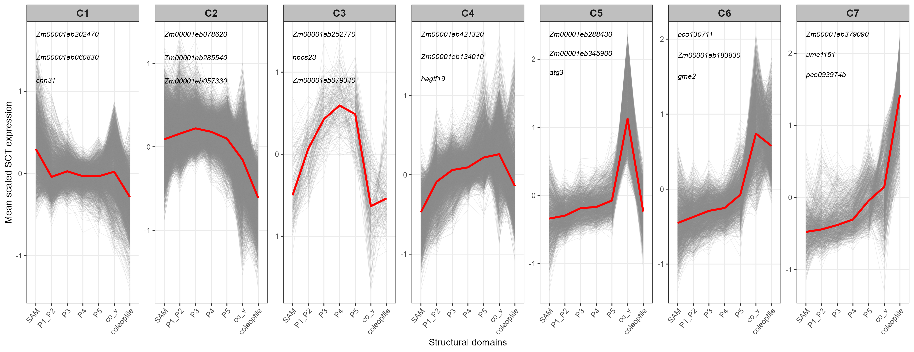
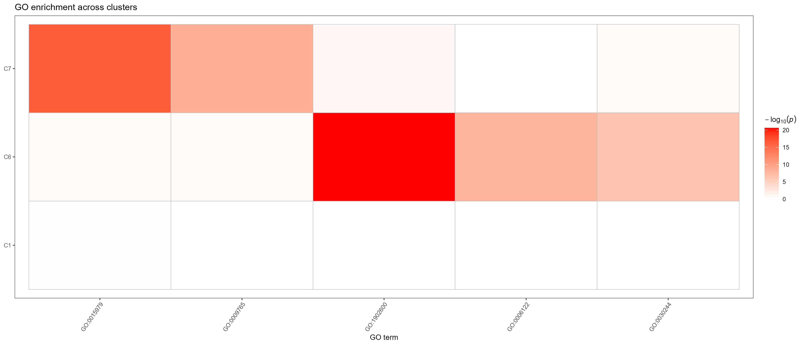
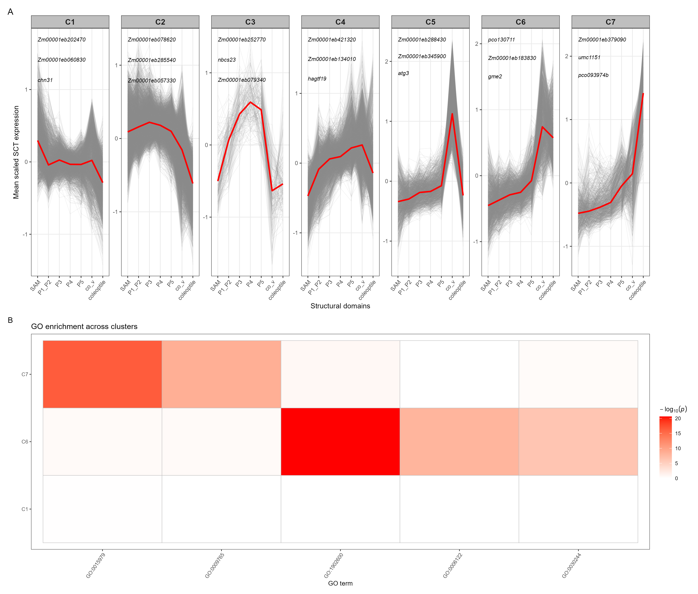

# Developmental expression trends and GO enrichment

This workflow reconstructs Figure 9 from the revised Seurat v5 dataset. It orders the seven structural domains as:

`SAM → P1_P2 → P3 → P4 → P5 → co_v → coleoptile`

The analysis script is:

[`01_developmental_expression_trends_and_GO_Figure_9_Seurat_v5.R`](../scripts/R/07_developmental_trends_GO/01_developmental_expression_trends_and_GO_Figure_9_Seurat_v5.R)

## Input

The main input is:

`data/processed/maize_shoot_14samples_SCT_harmony_seurat_v5.rds`

The Seurat object must contain:

- an `SCT` assay with a `data` layer;
- `sample_id`, identifying the biological replicate; and
- `domains`, containing the seven structural-domain labels.

Optional recovered reference files can be placed in:

`data/reference/developmental_trends/`

| File | Purpose |
|---|---|
| `sub_gene.csv` | Restricts clustering to the recovered set of eligible genes. |
| `zea_go2.csv` | Gene-to-GO mapping for reproducible hypergeometric enrichment. |
| `maize_id_name.csv` | Maps maize gene identifiers to short labels for representative genes. |
| `go_term_descriptions.csv` | Optional two-column GO-ID/term-name table. If absent, the script uses `GO.db` when installed and otherwise labels terms by GO ID. |

If `sub_gene.csv` is absent, all genes with non-zero mean SCT expression in every target domain are used. If `zea_go2.csv` is absent, the script still exports AgriGO-ready gene lists and produces an explanatory placeholder for panel B.

## Analysis

### Replicate-level aggregation

Individual Visium spots are not treated as independent biological replicates. SCT expression is first averaged within each `sample_id × domains` group. Each gene is then standardized across the replicate-by-domain profiles. The standardized profiles are averaged across biological replicates to obtain domain-level mean profiles for descriptive visualization.

### Developmental trend clustering

Genes are clustered from their seven domain-level mean profiles using Euclidean distance and complete-linkage hierarchical clustering. The dendrogram is cut into seven groups. Seven was retained because it provided the most informative summary in the original study; it is a descriptive choice rather than an inferentially estimated parameter.

Because the numeric labels returned by `cutree()` are arbitrary, the seven groups are relabeled from early- to late-weighted expression (`C1`–`C7`). This relabeling changes only cluster names, not membership.

For each cluster, the median developmental profile is calculated. The three genes with the smallest Euclidean distance from that median are reported as representative genes.

### GO enrichment

Within each trend cluster, genes are ranked by their mean SCT expression across replicate-domain profiles. The top 1,000 genes are exported for GO enrichment. The value 1,000 follows the original analysis and was an explicitly defined, arbitrary cutoff.

When `zea_go2.csv` is available, the script performs a one-sided hypergeometric test using all eligible expressed genes as the background and reports Benjamini–Hochberg-adjusted p-values in addition to raw p-values. To reproduce the manuscript panel, terms for Clusters 1, 6, and 7 with raw `p < 1 × 10⁻⁶` are displayed, up to the 29 most significant unique terms. The exported adjusted p-values should be used when interpreting enrichment beyond the descriptive manuscript figure.

The per-cluster text files can alternatively be submitted to AgriGO or an equivalent enrichment service.

## Run the workflow

Open the repository as the RStudio project, then run:

```r
source("scripts/R/07_developmental_trends_GO/01_developmental_expression_trends_and_GO_Figure_9_Seurat_v5.R")
```

## Outputs

Tables are written to:

`results/tables/07_developmental_trends_GO/`

Key tables include:

- `replicate_domain_profiles.csv`
- `domain_mean_scaled_expression.csv`
- `seven_expression_trend_cluster_assignments.csv`
- `representative_genes_three_per_cluster.csv`
- `top_1000_genes_per_cluster_for_GO.csv`
- `C1_top1000_AgriGO_gene_list.txt` through `C7_top1000_AgriGO_gene_list.txt`
- `GO_hypergeometric_enrichment_all_clusters.csv`, when a GO map is available

Figures are written to:

`results/figures/07_developmental_trends_GO/`

## Figure 9

The following images appear after the R workflow has completed. The paths are relative to this file, so they render correctly in GitHub and in a Markdown preview opened from the repository.

### A. Seven developmental expression-trend clusters



Gray lines represent individual genes, and the red line represents the median expression profile for each cluster. The three genes closest to the cluster median are labeled.

### B. GO enrichment for Clusters 1, 6, and 7



Color represents `−log10(p)` from the hypergeometric enrichment test. The plotted panel uses the manuscript threshold of `p < 1 × 10⁻⁶`.

### Combined figure



## Suggested figure legend

**Figure 9. Gene-expression trends and GO enrichment across maize shoot structural domains.** (A) Seven hierarchical clusters of gene-expression patterns across SAM, P1–P2, P3, P4, P5, coleoptile vein (co-v), and coleoptile. Gray lines represent individual genes, and the red line indicates the median trend within each cluster. Three representative genes nearest to each cluster median are shown. (B) GO enrichment heatmap for Clusters 1, 6, and 7 (`p < 1 × 10⁻⁶`). Colors represent `−log10(p)`. Adapted from Figure 3C–D of Wu et al. [1].

## Session information

The script writes the full R session record to:

[`07_developmental_trends_GO_sessionInfo.txt`](../results/sessionInfo/07_developmental_trends_GO_sessionInfo.txt)

```r
sessionInfo()
```
