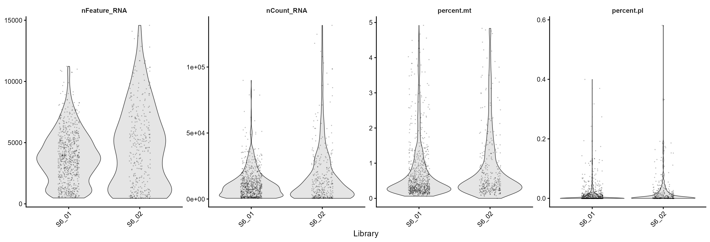
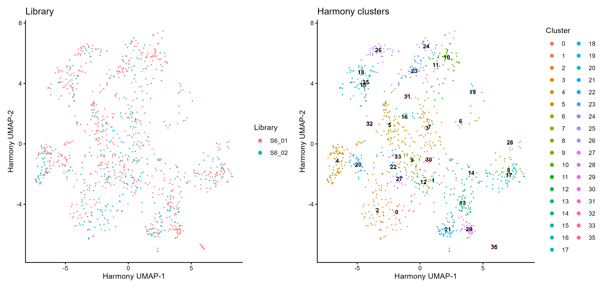
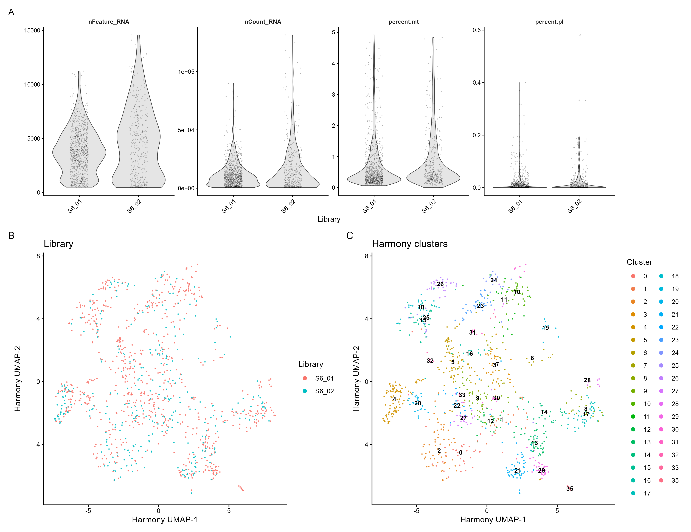

# 10.Maize shoot scRNA-seq reference: QC and Harmony integration

This workflow documents quality control and integration of the two maize shoot scRNA-seq reference libraries, SRR11943512 and SRR11943513. The processed Seurat reference and its lightweight plotting copy are stored as:

- `data/processed/sc_merged_filter_SCT2_inte.rds`
- `data/processed/sce_ref.rds`

The reconstruction and plotting scripts are:

- [`01_prepare_maize_scRNA_reference_SCT_Harmony_Seurat_v5.R`](../scripts/R/10_scRNA_reference_integration/01_prepare_maize_scRNA_reference_SCT_Harmony_Seurat_v5.R)
- [`02_plot_scRNA_reference_QC_and_Harmony.R`](../scripts/R/10_scRNA_reference_integration/02_plot_scRNA_reference_QC_and_Harmony.R)

## Input availability

The reconstruction script is provided for practice and full methodological transparency. The two large input matrices are not stored in GitHub. To run it, users must download the source data for SRR11943512 and SRR11943513, quantify the reads, and place the resulting 10x-style matrices under:

```text
data/raw/scRNA_reference/SRR11943512/filtered_feature_bc_matrix/
data/raw/scRNA_reference/SRR11943513/filtered_feature_bc_matrix/
```

Each directory must contain `matrix.mtx[.gz]`, `barcodes.tsv[.gz]`, and `features.tsv[.gz]` (or `genes.tsv[.gz]`). The script does not process SRA FASTQ files directly. Users who do not need to reconstruct the reference should begin with the deposited processed Seurat object, `sc_merged_filter_SCT2_inte.rds`.

## Analysis summary

The two raw gene-count matrices are imported separately with `CreateSeuratObject(min.cells = 3, min.features = 200)`. Doublets are identified independently in each library using scDblFinder, and only singlets are retained. The libraries are normalized using SCTransform v2 with `glmGamPoi`, followed by PCA. An elbow plot is inspected before selecting the first 30 PCs. The libraries are integrated with Harmony, layers are rejoined, and graph-based clustering is performed at resolution 2.

The plotting script is read-only. It uses an in-memory `sc_merged_filter_SCT2_inte` object when available; otherwise, it preferentially reads `sce_ref.rds`, which contains the QC metadata and Harmony coordinates required for the plots. The full Seurat RDS is the fallback input.

The figures embedded below were generated from `sce_ref.rds`. To regenerate them from the complete reference, first load `sc_merged_filter_SCT2_inte.rds` in RStudio as `sc_merged_filter_SCT2_inte`, and then source the plotting script.

The reconstruction script does not overwrite an existing final reference by default. If `sc_merged_filter_SCT2_inte.rds` is already present, sourcing the script safely skips the computationally expensive rebuild and writes an existing-output record and session information. Set `load_existing_output <- TRUE` to load and structurally validate the existing object. Set `overwrite_existing_output <- TRUE` only when intentionally rebuilding the reference from the raw count matrices.

## Panel A: quality-control distributions



**Panel A.** Violin plots showing the distributions of detected genes (`nFeature_RNA`), total UMI counts (`nCount_RNA`), mitochondrial-read percentage, and plastid-read percentage for the two sequencing libraries.

## Panel B: Harmony integration and clustering



**Panel B.** Harmony-corrected UMAP of the maize shoot scRNA-seq reference. The left panel is colored by sequencing library to assess mixing of SRR11943512 and SRR11943513. The right panel is colored and labeled by graph-based Harmony cluster at resolution 2.

## Combined figure



## Output tables

The plotting workflow writes the following files to `results/tables/10_scRNA_reference_integration/`:

- `scRNA_reference_QC_summary_by_library.csv`
- `scRNA_reference_cells_by_library_and_cluster.csv`
- `scRNA_reference_plot_inputs.csv`

## Run

From the repository root in RStudio:

```r
# Build the reference, or safely reuse the existing final RDS.
source("scripts/R/10_scRNA_reference_integration/01_prepare_maize_scRNA_reference_SCT_Harmony_Seurat_v5.R")

# Generate the QC and Harmony figures.
source("scripts/R/10_scRNA_reference_integration/02_plot_scRNA_reference_QC_and_Harmony.R")
```

## Session information

The complete runtime record is written to:

[`10_scRNA_reference_QC_plots_sessionInfo.txt`](../results/sessionInfo/10_scRNA_reference_QC_plots_sessionInfo.txt)

```r
sessionInfo()
```
