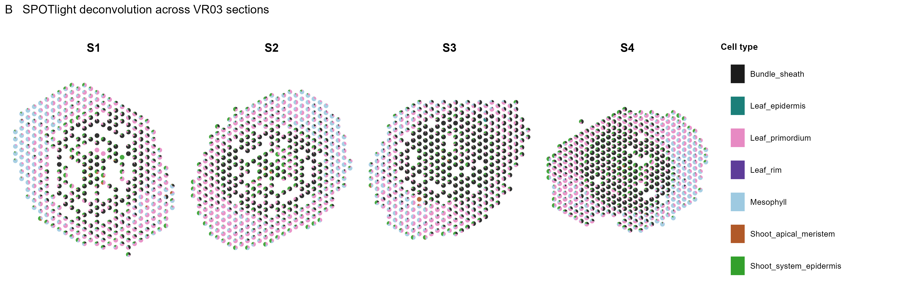
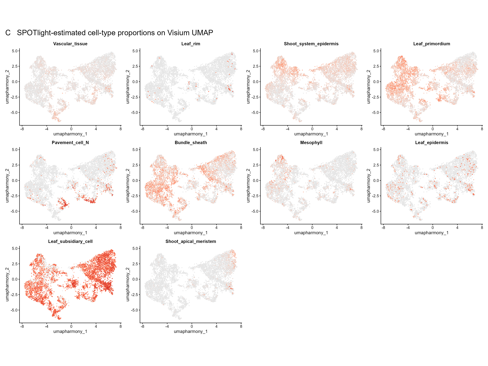
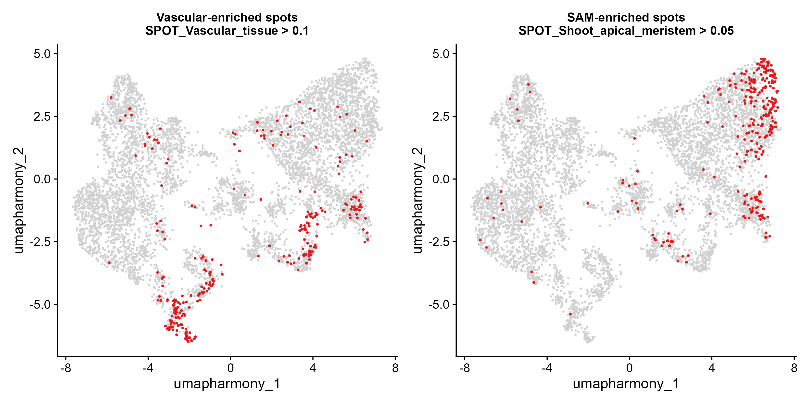

# Mapping scRNA-seq cell types onto maize Visium sections

This workflow combines Seurat anchor transfer with section-wise SPOTlight deconvolution. It is implemented in:

[`04_map_scRNA_to_Visium_SPOTlight_Seurat_v5.R`](../scripts/R/10_scRNA_reference_integration/04_map_scRNA_to_Visium_SPOTlight_Seurat_v5.R)

Selected vascular and SAM plots can be regenerated without rerunning deconvolution using:

[`05_plot_SPOTlight_celltypes_Visium_Seurat_v5.R`](../scripts/R/10_scRNA_reference_integration/05_plot_SPOTlight_celltypes_Visium_Seurat_v5.R)

## Inputs

- Annotated scRNA-seq reference: `data/processed/sc_merged_filter_SCT2_inte_SCINA.rds`
- Combined Visium object: `data/processed/maize_shoot_14samples_SCT_harmony_seurat_v5.rds`

Because both objects are large, the recommended procedure is to load them in RStudio as `sc_reference` and `visium_query` before sourcing the script. The workflow writes a new output object and does not overwrite either input.

### Choose the reference annotation field explicitly

The deposited annotated scRNA reference contains both `celltype_scina` and `celltype_scina_histo`. In script 04, use:

```r
reference_celltype_column <- "celltype_scina"
```

for the fully automated SCINA assignments. In the currently deposited object, these assignments include `G2_M_phase` and `S_phase`, but do not contain cells assigned to `Leaf_guard_cell` or `Pavement_cell_A`.

To reproduce the original 12-tissue-cell-type Figure B/C representation, use:

```r
reference_celltype_column <- "celltype_scina_histo"
```

This curated field contains `Leaf_guard_cell` and `Pavement_cell_A` and excludes the two cell-cycle labels. Changing the annotation field changes the SPOTlight reference and therefore requires a new deconvolution checkpoint; the choice must be reported with the analysis.

The lightweight `sce_ref.rds` can reproduce the SCINA validation plot but is not a substitute for the full annotated Seurat reference in this mapping workflow. If `sc_merged_filter_SCT2_inte_SCINA.rds` does not yet exist, first run:

```r
source("scripts/R/10_scRNA_reference_integration/03_scRNA_celltype_annotation_SCINA_Seurat_v5.R")
```

Step 03 now preferentially loads `sc_merged_filter_SCT2_inte.rds`, runs SCINA using the supplied marker table, and creates the required annotated RDS.

## Hard cell-type transfer

The annotated scRNA-seq object is used as the reference and the Visium object as the query. Cells labeled `Unknown` are excluded from reference construction. The script:

1. Uses the SCT assays of the reference and query.
2. Creates a reference UMAP model from the reference PCA reduction. PCA is used because Seurat's `pcaproject` mapping requires reference feature loadings; the Harmony reduction remains available for visualization.
3. Identifies transfer anchors with `FindTransferAnchors()` using the first 30 dimensions.
4. Calls `MapQuery()` with the SCINA cell-type labels as reference data.
5. Stores the hard assignments in `predicted.celltype` and the associated transfer score in `predicted.celltype.score`.

The transferred labels can be plotted on either the projected reference UMAP or the existing Harmony UMAP of the Visium object.

## SPOTlight reference preparation

The scRNA count matrix is converted to a `SingleCellExperiment` and log-normalized for marker and variance modeling. Marker and HVG preparation is performed once:

- Mitochondrial, plastid, and ribosomal genes are excluded using gene lists when supplied and conservative name patterns otherwise.
- Approximately 3,000 HVGs are selected with `modelGeneVar()` and `getTopHVGs()`.
- Cell-type markers are ranked by one-versus-all AUC using `presto::wilcoxauc()` on the sparse log-normalized reference matrix. Genes with AUC > 0.5 and positive log fold change are eligible.
- At most 100 markers are retained per cell type.
- The reference is downsampled reproducibly to no more than 100 cells per cell type.

The retained markers and HVGs are written to `results/tables/12_scRNA_Visium_mapping/`.

## Section-wise soft deconvolution

The combined Visium dataset is separated using `section_id`. Before count extraction, sample-specific Seurat v5 `counts.*` layers in the Visium RNA or Spatial assay are joined into one `counts` layer. SPOTlight is then run independently for every section using these raw counts. Only genes shared between the scRNA reference and the section are used.

For each section, SPOTlight performs seeded NMF to learn non-negative cell-type signatures, followed by non-negative least squares to estimate cell-type proportions for every spot. After removing any residual column, the retained cell-type proportions are normalized to sum to 1.

To test one section before launching the complete analysis, change:

```r
sections_to_run <- c("VR03_S2")
```

Set `sections_to_run <- NULL` for all sections.

### Recovery after an interrupted run

After every completed section, the workflow saves the accumulating proportion matrix and section diagnostics to:

- `results/tables/12_scRNA_Visium_mapping/SPOTlight_all_proportions_checkpoint.rds`
- `results/tables/12_scRNA_Visium_mapping/SPOTlight_section_diagnostics_checkpoint.rds`

The deconvolution results are also kept in the in-memory `all_proportions` matrix while the script is running. If a later post-processing or plotting step fails, source the script again with:

```r
resume_spotlight_from_memory <- TRUE
```

The script validates the spot and cell-type names, preferentially reuses the in-memory result, otherwise reads the disk checkpoint, and recomputes only incomplete sections. Therefore, restarting R does not require repeating completed section-level deconvolution.

The primary mapped Seurat object is saved before optional plotting begins. Consequently, a graphics-device or scatter-pie error cannot discard a completed deconvolution run.

For compatibility across Seurat and `uwot` versions, the final output is constructed from a clean reload of the original combined Visium RDS. The workflow transfers the durable Seurat prediction fields and all `SPOT_` metadata to this clean object before saving it. This preserves the original assays, spatial images, Harmony reduction, and active identities while excluding transient MapQuery projection models that can trigger recursive serialization errors on some Windows installations.

## Metadata added to the Visium object

Each cell-type proportion is stored using the prefix `SPOT_`, for example:

- `SPOT_Vascular_tissue`
- `SPOT_Shoot_apical_meristem`
- `SPOT_Mesophyll`

The following diagnostic fields are also added:

- `SPOT_top_type`: cell type with the highest estimated proportion
- `SPOT_top_prop`: maximum estimated proportion
- `SPOT_high_purity`: `TRUE` when the maximum proportion is at least 0.60
- `SPOT_entropy`: Shannon entropy of the proportion vector
- `SPOT_entropy_normalized`: Shannon entropy divided by the theoretical maximum

High-purity spots can be used for domain-specific differential-expression analysis, while all spots—including mixed spots—remain available for studying tissue interfaces.

## Reliability assessment

For spots with both results, the workflow compares the SPOTlight argmax call with the hard label transferred using Seurat anchors. It writes the per-spot comparison and the overall agreement rate.

An optional marker file can be provided at:

`data/metadata/scRNA_reference/independent_celltype_module_markers.csv`

This file must contain `gene_id` and `cell_type`. When present, the workflow calculates independent module scores and their Spearman correlations with the corresponding SPOTlight proportions.

## Visualization

The workflow generates:

- Spatial scatter-pie plots for the four consecutive VR03 sections used in Figure B (`VR03_S1`–`VR03_S4`) in `results/figures/12_scRNA_Visium_mapping/section_scatterpies/`
- Cell-type proportion maps on the Visium Harmony UMAP
- Original-study threshold overlays on the UMAP

Scatter-pie plotting is deliberately separated from deconvolution and wrapped in error handling. Spots with missing or non-finite image coordinates are excluded from a plot without affecting their estimated cell-type proportions in the saved dataset.

The original-study visualization thresholds are:

- Vascular-enriched spots: `SPOT_Vascular_tissue > 0.10`
- SAM-enriched spots: `SPOT_SAM_tissue > 0.05`, or the equivalent `SPOT_Shoot_apical_meristem > 0.05`

These thresholds are intended for visualization. They should not replace the 0.60 high-purity criterion used for downstream domain-specific testing.

### Figure B and C plots from the existing processed subset

The following plots were generated from `XGE202122_S5_subset_embleaf_harmony_join.rds`, which contains 6,392 Visium spots and the previously estimated proportions for 12 cell types. They document the expected plotting outputs without rerunning the complete section-wise deconvolution.



**Figure B. SPOTlight deconvolution across four consecutive sections from sample VR03.** Sections are labeled S1–S4. Each Visium spot is shown as a pie chart; sectors represent the estimated proportions of bundle sheath, leaf epidermis, guard cell, leaf primordium, leaf rim, mesophyll, pavement cell A, shoot apical meristem, and shoot system epidermis. The spatial maps show coherent localization patterns, with vascular-associated types aligned with vein corridors, epidermal and rim types enriched in outer domains, and primordium-associated cells localized to developing leaf margins.



**Figure C. SPOTlight-estimated cell-type proportions on the Visium Harmony UMAP.** The continuous color scale ranges from light gray (0) to deeper red (higher proportion). Panels show `Vascular_tissue`, `Leaf_rim`, `Shoot_system_epidermis`, `Leaf_primordium`, `Pavement_cell_N`, `Leaf_guard_cell`, `Bundle_sheath`, `Mesophyll`, `Leaf_epidermis`, `Leaf_subsidiary_cell`, `Shoot_apical_meristem`, and `Pavement_cell_A`. Because the proportions at each 55-µm spot sum to 1, SPOTlight captures graded cell-type mixtures that complement the single best label assigned by Seurat.



**Original-study threshold overlays.** Spots exceeding `SPOT_Vascular_tissue > 0.10` or `SPOT_Shoot_apical_meristem > 0.05` are highlighted in red on the Visium Harmony UMAP; all other spots are shown in gray.

## Output object

The mapped and deconvolved Visium object is written to:

`data/processed/maize_shoot_14samples_celltype_mapped_SPOTlight_seurat_v5.rds`

The original active identities are restored before the output is saved.

## Run

From the repository root in RStudio:

```r
sc_reference <- readRDS(
  "data/processed/sc_merged_filter_SCT2_inte_SCINA.rds"
)
visium_query <- readRDS(
  "data/processed/maize_shoot_14samples_SCT_harmony_seurat_v5.rds"
)
source(
  "scripts/R/10_scRNA_reference_integration/04_map_scRNA_to_Visium_SPOTlight_Seurat_v5.R"
)
```

## Session information

After a successful run, the runtime record is written to:

[12_scRNA_Visium_mapping_sessionInfo.txt](../results/sessionInfo/12_scRNA_Visium_mapping_sessionInfo.txt)

The standalone script 05 additionally writes:

[12_scRNA_Visium_plotting_sessionInfo.txt](../results/sessionInfo/12_scRNA_Visium_plotting_sessionInfo.txt)

```r
sessionInfo()
```
